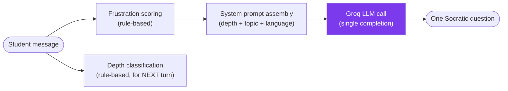
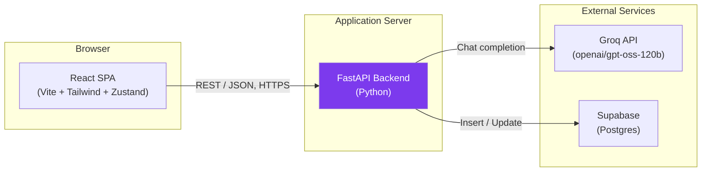

<div align="center">

# 🪞 Socratic Mirror

### *An AI that never answers — only asks.*


An LLM-powered Socratic dialogue engine built for reflective learning.

[]()
[]()
[]()
[]()
[]()
[]()
[]()
[]()

</div>

---

## 📑 Table of Contents

- [🪞 Socratic Mirror](#-socratic-mirror)
    - [*An AI that never answers — only asks.*](#an-ai-that-never-answers--only-asks)
  - [📑 Table of Contents](#-table-of-contents)
  - [📖 Introduction](#-introduction)
  - [💡 Project Motivation](#-project-motivation)
  - [❓ Problem Statement](#-problem-statement)
  - [✅ Solution Overview](#-solution-overview)
  - [✨ Key Features](#-key-features)
  - [🎓 Educational Philosophy](#-educational-philosophy)
  - [🤖 AI Overview](#-ai-overview)
  - [🏗️ High-Level Architecture](#️-high-level-architecture)
  - [🛠️ Technology Stack](#️-technology-stack)
  - [📁 Folder Structure](#-folder-structure)
  - [🚀 Quick Start](#-quick-start)
  - [📦 Installation](#-installation)
  - [⚙️ Configuration](#️-configuration)
  - [🧭 Usage](#-usage)
  - [📚 Documentation Index](#-documentation-index)
  - [🗺️ Roadmap Summary](#️-roadmap-summary)
  - [🤝 Contributing](#-contributing)
  - [📄 License](#-license)
  - [👤 Author](#-author)
  - [🙏 Acknowledgements](#-acknowledgements)
  - [❓ FAQ](#-faq)

---

## 📖 Introduction

**Socratic Mirror** is an AI learning companion with one absolute rule: it never gives a student the answer. Instead of explaining a concept, it asks a sequence of increasingly demanding questions — escalating across eight defined cognitive "depth levels" — that push the student to construct their own understanding.

It is a small, deliberately simple system: a React frontend, a FastAPI backend, a single prompt-engineered LLM call per turn, and a two-table Postgres database. There is no fine-tuning, no retrieval pipeline, and no agentic tool use — the entire pedagogical behavior comes from careful prompt design and a small amount of surrounding deterministic logic. This README is the entry point; every implementation detail referenced below lives in a dedicated document under [`docs/`](#-documentation-index).

## 💡 Project Motivation

Most AI tutoring tools are optimized to satisfy a student in the moment — and the fastest way to do that is to give them the answer. Socratic Mirror inverts that trade-off on purpose: it accepts short-term friction in exchange for the durable learning benefit of a student reasoning their own way to understanding. The full pedagogical reasoning behind this trade-off is documented in [`docs/AI-Design.md`](docs/AI-Design.md#3-educational-philosophy).

## ❓ Problem Statement

A student asking an AI "what does this mean?" today is one prompt away from a complete, no-effort answer — which closes off the productive struggle that builds real understanding. There is no widely available tool that structurally *refuses* to answer while still being genuinely useful: most attempts at this either feel obstructive (the AI just says "I won't tell you") or quietly cave under a determined student. Socratic Mirror's challenge is making refusal-to-answer pedagogically *useful*, not just an obstacle.

## ✅ Solution Overview

Socratic Mirror solves this with a layered design:

| Layer | What it does | Documented in |
|---|---|---|
| **Prompt layer** | One system prompt per turn, enforcing "ask exactly one question, never answer" via strict rules and a contrastive few-shot example | [`docs/Prompt-Engineering.md`](docs/Prompt-Engineering.md) |
| **Depth layer** | Eight named cognitive levels (Clarification → Reflection) the conversation progresses through | [`docs/AI-Design.md`](docs/AI-Design.md) |
| **Adaptation layer** | Rule-based frustration detection and depth classification that respond to *how* the student is doing, not a fixed script | [`docs/AI-Design.md`](docs/AI-Design.md) |
| **Application layer** | A FastAPI backend orchestrating the above, and a React frontend visualizing the student's progress in real time | [`docs/Architecture.md`](docs/Architecture.md) |

## ✨ Key Features

- 🪞 **Never answers directly** — a strictly enforced, single-question-per-turn Socratic constraint
- 🧠 **Eight-level depth progression** — Clarification, Assumptions, Evidence, Viewpoints, Implications, Meta-Inquiry, Connections, Reflection
- 📈 **Adaptive difficulty** — depth advances or regresses based on the student's own reasoning signals, not a fixed sequence
- 😤 **Frustration-aware** — automatically softens question difficulty when a student shows signs of disengagement
- 🌐 **Bilingual** — full English and Kannada (ಕನ್ನಡ) support, including language-aware frustration detection
- 📊 **Live thinking metrics** — a real-time depth meter and stats sidebar visualizing the student's own reasoning trajectory
- ⚡ **Fast inference** — powered by Groq for low-latency, conversational-feeling responses
- 🧩 **Minimal infrastructure** — no fine-tuning, no vector database, no message queue; the system is small enough to read end to end

> ℹ️ **Note:** Several built capabilities (session resume, explicit session-end) exist in the backend but aren't yet wired into the frontend. See [`docs/API.md`](docs/API.md) and [`docs/Future-Roadmap.md`](docs/Future-Roadmap.md) for details.

## 🎓 Educational Philosophy

Socratic Mirror's design rests on four pedagogical ideas — productive struggle over instant answers, depth as a teachable (not black-box) structure, adaptive pacing instead of a fixed curriculum, and a defined endpoint rather than infinite engagement. These are explained in full, with the reasoning behind each, in [`docs/AI-Design.md` §3](docs/AI-Design.md).

## 🤖 AI Overview

A single LLM call (`openai/gpt-oss-120b`, served via Groq) generates each probe question, guided by a system prompt rebuilt fresh on every turn. Everything around that one call — frustration scoring, depth classification, session termination — is deterministic, non-LLM Python logic, making the conversation's *progression* fully reproducible even though each question's exact wording is not.



Full detail — the eight depth levels, the prompt's exact structure, frustration/depth logic, and every known limitation — lives in [`docs/AI-Design.md`](docs/AI-Design.md) and [`docs/Prompt-Engineering.md`](docs/Prompt-Engineering.md).

## 🏗️ High-Level Architecture

A three-tier system: a React SPA, a FastAPI backend owning all business logic, and two external managed services. The frontend never talks to Groq or Supabase directly — every external call is mediated by the backend, keeping credentials server-side.



> 📘 This is a summary diagram. The complete architecture — including the backend's internal module structure, the frontend's component tree, and known build/deployment risks — is documented in [`docs/Architecture.md`](docs/Architecture.md) and synthesized system-wide in [`docs/System-Design.md`](docs/System-Design.md).

## 🛠️ Technology Stack

| Layer | Technology |
|---|---|
| Frontend framework | React 19 (Vite) |
| Frontend styling | Tailwind CSS |
| Frontend state | Zustand |
| Frontend HTTP client | Axios |
| Backend framework | FastAPI (Python) |
| Backend validation | Pydantic / pydantic-settings |
| LLM inference | Groq (`openai/gpt-oss-120b`) |
| Database | Supabase (hosted Postgres, accessed via REST client) |
| Local dev server | uvicorn (backend), Vite dev server (frontend) |

> ⚠️ No `Dockerfile`, CI/CD pipeline, or infrastructure-as-code currently exists in this repository — see [`docs/Deployment.md`](docs/Deployment.md) for the honest, current state of deployment and a set of recommendations.

## 📁 Folder Structure

```
socratic-mirror/
├── backend/
│   ├── app/
│   │   ├── main.py
│   │   ├── api/            # chat, session, health routes
│   │   ├── services/       # socratic_engine, depth_classifier,
│   │   │                   # frustration_detector, db
│   │   ├── prompts/        # socratic_system.py
│   │   └── core/           # config.py
│   ├── tests/
│   └── requirements.txt
├── frontend/
│   └── src/
│       ├── components/     # LandingScreen, ChatScreen, StatsSidebar, ErrorScreen
│       ├── store/          # sessionStore.js (Zustand)
│       └── utils/          # api.js (Axios)
├── research/
└── docs/                   # the documentation set linked below
```

For the full annotated breakdown of every module's responsibility, see [`docs/Architecture.md`](docs/Architecture.md) and [`docs/Contributing.md` §3](docs/Contributing.md).

## 🚀 Quick Start

```bash
# 1. Clone the repository
git clone <repository-url>
cd socratic-mirror

# 2. Backend
cd backend
python -m venv .venv && source .venv/bin/activate
pip install -r requirements.txt
# create backend/.env — see Configuration below
uvicorn app.main:app --reload --port 8000

# 3. Frontend (in a second terminal)
cd frontend
npm install
npm run dev
```

Then open `http://localhost:5173`. For full step-by-step instructions, prerequisites, and verification steps, see [`docs/Deployment.md`](docs/Deployment.md).

## 📦 Installation

> 📘 Full prerequisites (Python, Node, a Groq account, a Supabase project with the schema provisioned) and detailed setup steps for both backend and frontend are documented in [`docs/Deployment.md` §3–§8](docs/Deployment.md).

In short: this project requires a working **Groq API key** and a **Supabase project** with the `sessions` and `turns` tables already created — there is no local mock for either, and no migration tooling provisions the schema automatically. See [`docs/Database.md` §11](docs/Database.md) for the inferred schema to use as a starting point.

## ⚙️ Configuration

| Variable | Required | Default | Where it's used |
|---|---|---|---|
| `GROQ_API_KEY` | ✅ Yes | — | Backend, LLM calls |
| `SUPABASE_URL` | ✅ Yes | — | Backend, persistence |
| `SUPABASE_KEY` | ✅ Yes | — | Backend, persistence |
| `ENVIRONMENT` | ❌ No | `development` | Backend (currently unused at runtime) |
| `VITE_API_URL` | ❌ No | `http://localhost:8000/api/v1` | Frontend, API base URL |

> ⚠️ **The backend will fail to start** if any of the three required backend variables are missing — they have no defaults. Full configuration detail, including a worked `.env` example, is in [`docs/Deployment.md` §7](docs/Deployment.md).

## 🧭 Usage

1. Open the app and choose a topic — type your own, or pick a suggested one (e.g., *Newton's Second Law*, *Photosynthesis*).
2. Choose a language — English or Kannada.
3. Share your current understanding of the topic in the chat.
4. Socratic Mirror responds with exactly one question — never an answer — calibrated to your current depth level.
5. Keep responding; the depth meter on the left tracks your progression through all eight levels.
6. The session concludes once you reach Level 8 (Reflection) and answer the final "what did you learn?" question.

For the complete API contract behind this flow, see [`docs/API.md`](docs/API.md).


## 📚 Documentation Index

This README is intentionally a summary. Every implementation detail lives in one of the documents below:

| Document | Covers |
|---|---|
| [`docs/Architecture.md`](docs/Architecture.md) | Full software architecture — frontend, backend, AI, and database structure, request/session lifecycles, error flow, and deployment topology |
| [`docs/AI-Design.md`](docs/AI-Design.md) | The complete AI system design — goals, educational philosophy, the eight depth levels, frustration detection, depth classification, LLM integration, and safety constraints |
| [`docs/API.md`](docs/API.md) | The full HTTP API reference — every endpoint's request/response contract, validation rules, status codes, and security notes |
| [`docs/Database.md`](docs/Database.md) | The persistence layer — schema (inferred), CRUD operations, data lifecycle, and security considerations |
| [`docs/Prompt-Engineering.md`](docs/Prompt-Engineering.md) | The complete prompt engineering strategy — prompt structure, dynamic generation, depth/frustration/language adaptation, guardrails, and injection risks |
| [`docs/System-Design.md`](docs/System-Design.md) | A system-wide synthesis — data flow, control flow, security architecture, scalability, performance, logging, and monitoring |
| [`docs/Deployment.md`](docs/Deployment.md) | A complete deployment guide — local setup, environment variables, production recommendations, and troubleshooting |
| [`docs/Contributing.md`](docs/Contributing.md) | Contribution guidelines — coding standards, naming conventions, PR process, and testing expectations |
| [`docs/Future-Roadmap.md`](docs/Future-Roadmap.md) | The complete, checklist-driven roadmap across every layer of the system |

## 🗺️ Roadmap Summary

A few representative highlights — the full, checklist-driven roadmap across every layer (AI, backend, frontend, database, security, deployment, and open research questions) lives in [`docs/Future-Roadmap.md`](docs/Future-Roadmap.md).

- [ ] Fix known bugs (a frontend build-casing issue, a backend/frontend response contract mismatch)
- [ ] Add the project's first automated tests
- [ ] Introduce authentication and rate limiting
- [ ] Move toward semantic (rather than keyword-based) depth and frustration detection
- [ ] Add a Dockerfile and CI/CD pipeline

## 🤝 Contributing

Contributions are welcome. Before opening a pull request, please read [`docs/Contributing.md`](docs/Contributing.md), which covers the project's philosophy, coding standards, naming conventions, branch and commit conventions, code review expectations, and (honestly) the current state of testing in this codebase.

## 📄 License

> ⚠️ No `LICENSE` file currently exists in this repository. Until one is added, no license terms are confirmed — please check with the project maintainers before reuse or redistribution.

## 👤 Author

Built by the Socratic Mirror team — **PI Labs · PES University .**

## 🙏 Acknowledgements

- [Groq](https://groq.com) — for fast, free-tier-friendly LLM inference
- [Supabase](https://supabase.com) — for a zero-infrastructure managed Postgres backend
- The open-source React, FastAPI, and Tailwind CSS communities

## ❓ FAQ

**Does Socratic Mirror ever give a direct answer?**
No — this is the system's one absolute, deliberately enforced rule. See [`docs/AI-Design.md`](docs/AI-Design.md) and [`docs/Prompt-Engineering.md`](docs/Prompt-Engineering.md) for exactly how this is enforced, and its honest limitations.

**What languages are supported?**
English and Kannada (ಕನ್ನಡ) today, with the underlying pattern designed to be extensible — see [`docs/Future-Roadmap.md`](docs/Future-Roadmap.md#12-research-ideas) for thinking on extending this further.

**Is there a hosted demo I can try?**
Currently, there is no public hosted deployment.

Follow the Installation and Quick Start sections to run the project locally.
**Does this require an OpenAI or Anthropic API key?**
No — inference runs through Groq using an open-weight model. See [`docs/AI-Design.md` §15](docs/AI-Design.md) for why Groq was chosen.

**Is this production-ready?**
Not yet, by the project's own documentation — there's no authentication, rate limiting, automated testing, or confirmed production deployment today. These gaps are documented openly, not hidden, throughout [`docs/System-Design.md`](docs/System-Design.md) and [`docs/Future-Roadmap.md`](docs/Future-Roadmap.md).

**Where do I report a bug or security issue?**
See [`docs/Contributing.md` §13–§15](docs/Contributing.md) for the project's issue-reporting and responsible-disclosure guidelines.
