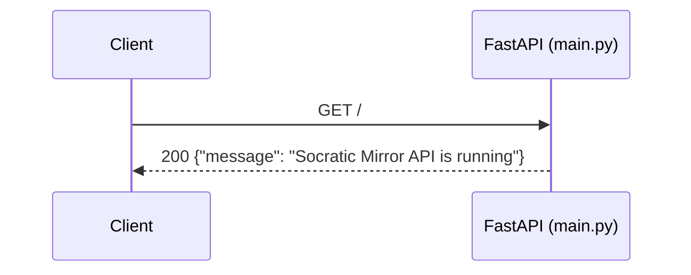
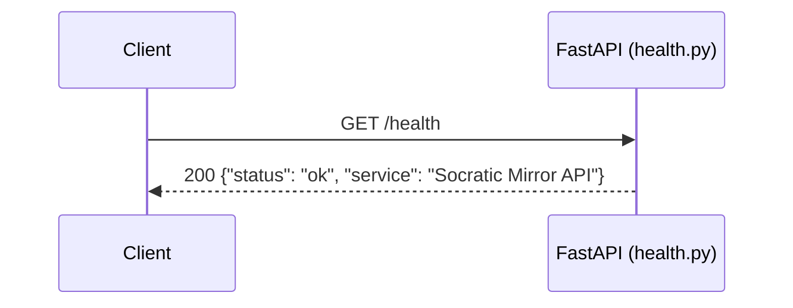
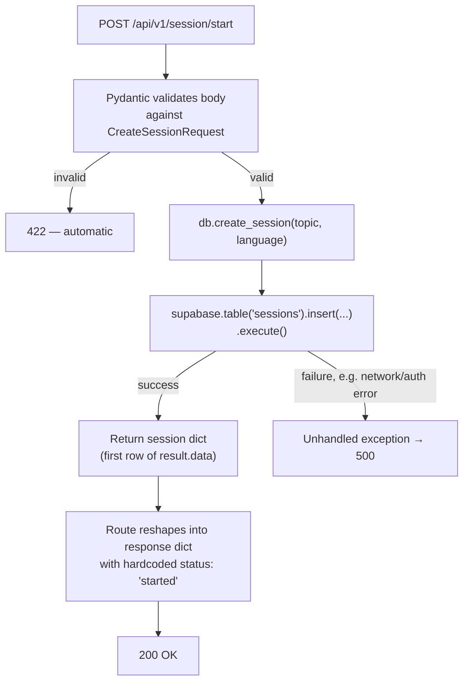
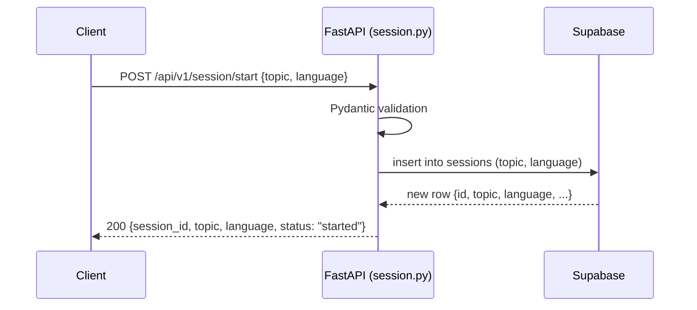
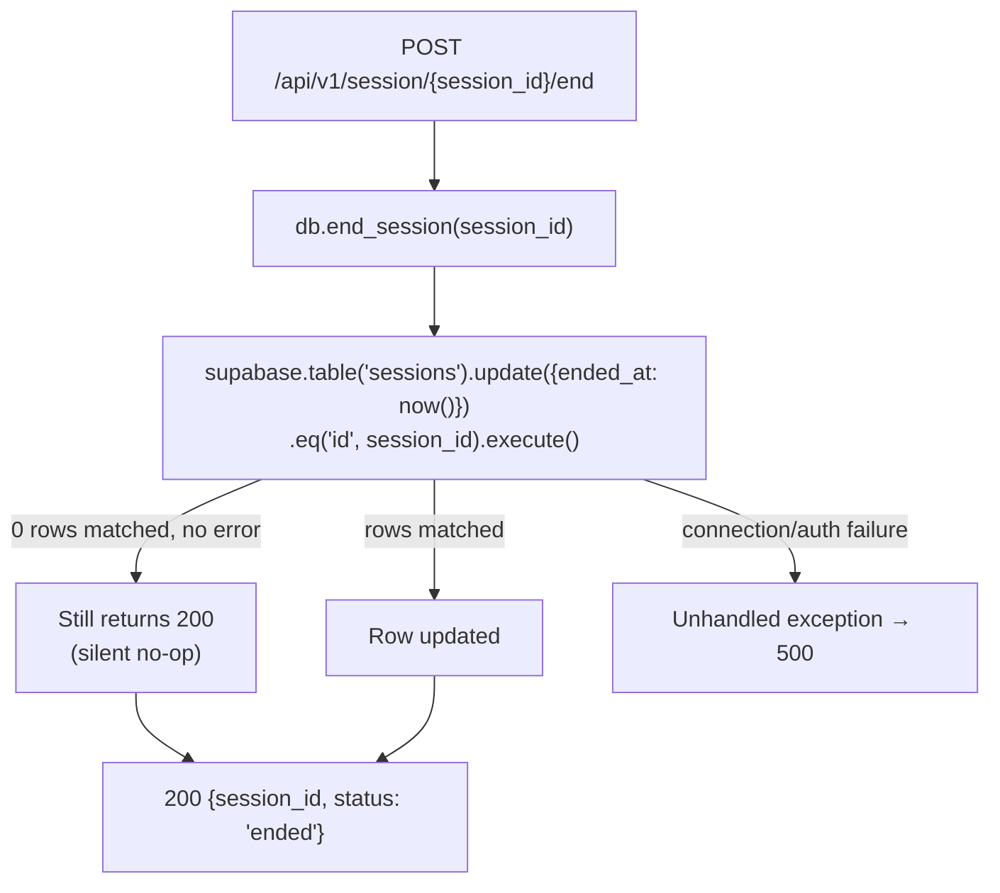
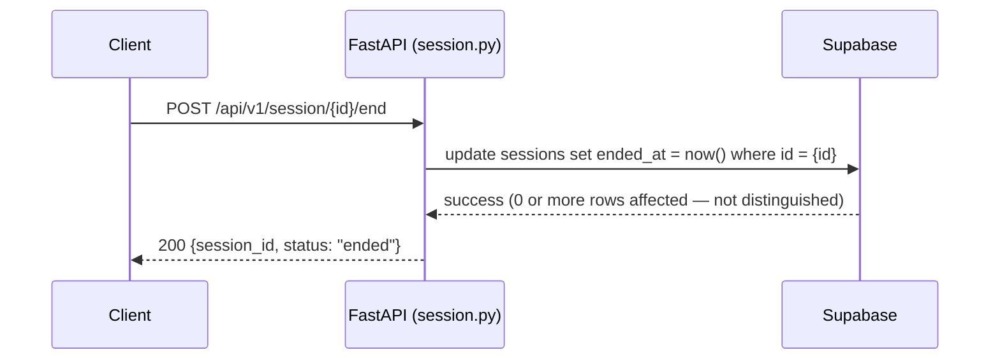
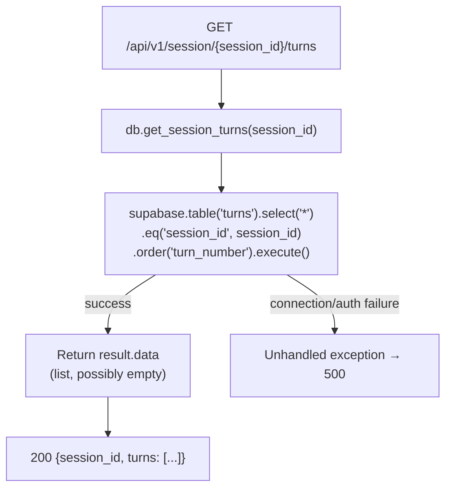
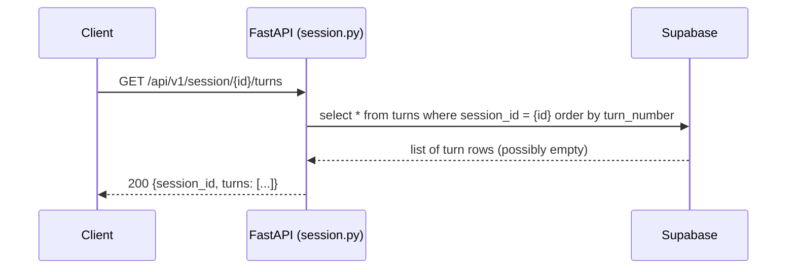
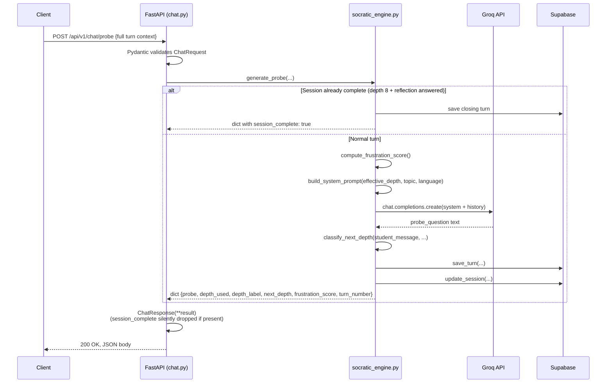

# API Documentation — Socratic Mirror Backend

**Base URL (local development):** `http://localhost:8000`
**Base URL (production):** Not confirmed in the codebase — the only evidence of a production deployment is the CORS allowlist entry `https://socratic-mirror.vercel.app`, which is the *frontend's* URL, not the backend's. The backend's production base URL is unknown from the repository alone.

**API versioning:** All routes except `GET /` and `GET /health` are mounted under the `/api/v1` prefix (applied in `main.py` via `app.include_router(session.router, prefix="/api/v1")` and the equivalent for `chat.router`). `/` and `/health` are intentionally unversioned, which is a reasonable choice for infrastructure-level endpoints that orchestration tools (load balancers, uptime monitors) typically expect at a stable, version-independent path.

**Authentication:** None. No endpoint in this API requires an API key, session token, or any other credential. Any client that can reach the server can call every endpoint, including reading or ending sessions it didn't create (see Security Notes throughout).

**Content type:** All POST request bodies are JSON (`Content-Type: application/json`); all responses are JSON.

**Error handling baseline:** Confirmed by direct inspection of every route handler — **no endpoint in this codebase contains a `try/except` block.** The only error responses you will ever see from this API are: (a) FastAPI/Pydantic's automatic `422 Unprocessable Entity` for malformed request bodies, and (b) an unhandled `500 Internal Server Error` (with a raw Python traceback in the response body, since no custom exception handler is registered) for anything that fails inside a route — a Groq timeout, an invalid API key, Supabase being unreachable, a missing session ID, etc. This applies uniformly to every endpoint below and is not repeated as a caveat under each one beyond a brief reminder.

---

## Endpoint Index

| Method | Path | Purpose |
|---|---|---|
| GET | `/` | Root liveness message |
| GET | `/health` | Health check |
| POST | `/api/v1/session/start` | Create a new tutoring session |
| POST | `/api/v1/session/{session_id}/end` | Mark a session as ended |
| GET | `/api/v1/session/{session_id}/turns` | Retrieve full turn history for a session |
| POST | `/api/v1/chat/probe` | Generate the next Socratic question (core endpoint) |

---

## GET /

### Purpose
A bare liveness message confirming the FastAPI process is up and routing requests. Defined directly in `main.py`, not in a router module.

### HTTP Method
`GET`

### URL
`/`

### Description
Returns a static JSON message. Has no dependencies — does not touch Groq, Supabase, or any service module. Useful as the simplest possible "is the process alive at all" check, distinct from `/health` which is semantically the same today but lives in its own router and could diverge in the future (e.g., if `/health` is later extended to check downstream dependencies).

### Request Body
None.

### Response Body
```json
{
  "message": "Socratic Mirror API is running"
}
```

### Parameters
None.

### Validation Rules
None — no input is accepted.

### Status Codes
| Code | Meaning |
|---|---|
| 200 | Always, if the process is running and routing requests. |

### Error Responses
None possible at the application level — this handler cannot throw.

### Example Request
```bash
curl http://localhost:8000/
```

### Example Response
```json
{
  "message": "Socratic Mirror API is running"
}
```

### Internal Processing Flow
A single synchronous function returns a hardcoded dictionary. No service layer, no database, no external call.

### Security Notes
Unauthenticated by design, as expected for a liveness endpoint. Reveals nothing sensitive.

### Sequence Diagram


---

## GET /health

### Purpose
A dedicated, conventionally-named health-check endpoint, separate from `/`, typically the kind of path an uptime monitor or container orchestrator (e.g., Kubernetes liveness/readiness probes) would be pointed at.

### HTTP Method
`GET`

### URL
`/health`

### Description
Returns a static status object. Defined in `app/api/health.py`, registered in `main.py` with **no `/api/v1` prefix** — it sits at the application root alongside `/`, not under the versioned API namespace. Like `/`, it currently performs no actual dependency checks (it does not verify Groq reachability, Supabase connectivity, or anything else) — "health" here means "the FastAPI process is responding," not "all downstream systems are operational."

### Request Body
None.

### Response Body
```json
{
  "status": "ok",
  "service": "Socratic Mirror API"
}
```

### Parameters
None.

### Validation Rules
None.

### Status Codes
| Code | Meaning |
|---|---|
| 200 | Always, if the process is running. |

### Error Responses
None possible — cannot throw.

### Example Request
```bash
curl http://localhost:8000/health
```

### Example Response
```json
{
  "status": "ok",
  "service": "Socratic Mirror API"
}
```

### Internal Processing Flow
Identical pattern to `GET /` — a single function returning a static dictionary, no service or database layer involved.

### Security Notes
Unauthenticated by design. No sensitive data exposed. Worth noting for whoever eventually wires up monitoring: because this endpoint doesn't check Groq or Supabase, a "healthy" response here does **not** guarantee `/chat/probe` will actually succeed — the two failure-prone external dependencies are entirely unchecked by this endpoint as currently implemented.

### Sequence Diagram


---

## POST /api/v1/session/start

### Purpose
Creates a new tutoring session — the first call any frontend client makes, before any chat turns can happen. Establishes the topic and language the rest of the session will be conducted in, and returns the `session_id` that every subsequent `/chat/probe` call must include.

### HTTP Method
`POST`

### URL
`/api/v1/session/start`

### Description
Accepts a topic and an optional language, inserts a new row into Supabase's `sessions` table via `db.create_session()`, and returns the newly created session's identity. This is the only endpoint that creates session rows — there is no way to resume or rehydrate an existing session through this endpoint; each call always creates a brand-new row.

### Request Body
```json
{
  "topic": "Newton's Second Law",
  "language": "english"
}
```

Defined by the `CreateSessionRequest` Pydantic model in `session.py`:

| Field | Type | Required | Default |
|---|---|---|---|
| `topic` | `string` | Yes | — |
| `language` | `string` | No | `"english"` |

### Response Body
```json
{
  "session_id": "string (UUID, as returned by Supabase)",
  "topic": "string",
  "language": "string",
  "status": "started"
}
```

The `"status": "started"` field is a hardcoded literal in the route handler, not a value read from the database — it is always exactly the string `"started"` on every successful call.

### Parameters
None (no path or query parameters — all input is in the request body).

### Validation Rules
- `topic` must be present and must be a string. **No length constraint exists** — an empty string (`""`) is technically valid per the Pydantic model and would be accepted, passed through to Supabase, and only fail (if at all) based on whatever constraints exist on the database column itself, which are not visible from this codebase.
- `language` is unconstrained — any string is accepted, including values other than `"english"` or `"kannada"`. The backend does not validate against an enum. (Note: only `"kannada"` triggers special handling later in `build_system_prompt()` — any other value, including typos like `"kanada"`, silently falls through to English-language prompting with no error or warning.)

### Status Codes
| Code | Meaning |
|---|---|
| 200 | Session created successfully. |
| 422 | Request body fails Pydantic validation (e.g., `topic` field missing entirely, or wrong type). |
| 500 | Unhandled exception — most likely Supabase being unreachable, the Supabase key being invalid, or the `sessions` table/columns not existing as expected. No custom error message; raw traceback. |

### Error Responses
No structured error response exists. A validation failure returns FastAPI's default 422 body:
```json
{
  "detail": [
    {
      "type": "missing",
      "loc": ["body", "topic"],
      "msg": "Field required",
      "input": {}
    }
  ]
}
```
A downstream failure (e.g., Supabase down) returns an unhandled 500 with a Python traceback in the response body — there is no `try/except` in `start_session()` or `db.create_session()` to catch and translate this into a clean error message.

### Example Request
```bash
curl -X POST http://localhost:8000/api/v1/session/start \
  -H "Content-Type: application/json" \
  -d '{"topic": "Photosynthesis", "language": "english"}'
```

### Example Response
```json
{
  "session_id": "a1b2c3d4-e5f6-7890-abcd-ef1234567890",
  "topic": "Photosynthesis",
  "language": "english",
  "status": "started"
}
```

### Internal Processing Flow


### Security Notes
No authentication — anyone can create unlimited sessions, with no rate limiting anywhere in the stack (confirmed: no throttling logic exists in this codebase). This is a direct cost-exposure risk, since every session eventually leads to billable Groq API calls. There is also no validation preventing extremely long `topic` strings, which then flow directly into the LLM system prompt on every subsequent turn of that session.

### Sequence Diagram


---

## POST /api/v1/session/{session_id}/end

### Purpose
Marks an existing session as ended by stamping its `ended_at` timestamp in the database. Intended to represent an explicit close-out of a tutoring session.

### HTTP Method
`POST`

### URL
`/api/v1/session/{session_id}/end`

### Description
Calls `db.end_session(session_id)`, which sets `ended_at` to the current UTC time on the matching row in the `sessions` table. **This endpoint is currently not called anywhere in the frontend codebase** — `frontend/src/utils/api.js` exposes only `startSession()` and `getProbe()`. This endpoint exists and is fully functional, but is unreachable through normal product use today; it would need to be wired into the frontend (e.g., on the "session complete" UI state, or an explicit "end session" button) to actually be exercised.

### Request Body
None.

### Response Body
```json
{
  "session_id": "string",
  "status": "ended"
}
```

As with `/start`, the `"status": "ended"` value is a hardcoded literal returned regardless of whether the underlying database update actually matched any row.

### Parameters
| Name | Location | Type | Required | Description |
|---|---|---|---|---|
| `session_id` | Path | `string` | Yes | The session to mark as ended. |

### Validation Rules
`session_id` is typed as a plain `string` path parameter — there is no UUID-format validation. Passing a non-existent or malformed `session_id` does **not** produce an error: Supabase's `.update(...).eq("id", session_id).execute()` will simply match zero rows and silently succeed, and the endpoint will still return `{"session_id": <whatever was passed>, "status": "ended"}` as if it worked. This is a notable correctness gap — callers cannot distinguish "successfully ended a real session" from "no such session exists" from this response alone.

### Status Codes
| Code | Meaning |
|---|---|
| 200 | Returned in all cases where the Supabase call itself doesn't throw — including when `session_id` doesn't match any row (see above). |
| 422 | `session_id` missing from the URL (effectively impossible given FastAPI's path-parameter routing — this would instead 404 at the routing layer if the path itself doesn't match). |
| 500 | Supabase unreachable or credentials invalid. |

### Error Responses
No structured "session not found" response exists — see Validation Rules above. The only error path is the generic unhandled 500.

### Example Request
```bash
curl -X POST http://localhost:8000/api/v1/session/a1b2c3d4-e5f6-7890-abcd-ef1234567890/end
```

### Example Response
```json
{
  "session_id": "a1b2c3d4-e5f6-7890-abcd-ef1234567890",
  "status": "ended"
}
```

### Internal Processing Flow


### Security Notes
No authentication or ownership check exists. Any client that knows or guesses a `session_id` (returned as a plain UUID, not a secret token) can end *any* session, not just one it created itself — there is no concept of session ownership anywhere in this API. Note also that `HTTPException` is imported at the top of `session.py` but is never actually raised anywhere in the file — suggesting an intent to add proper error responses (e.g., a 404 for a non-existent session) that was never completed.

### Sequence Diagram


---

## GET /api/v1/session/{session_id}/turns

### Purpose
Retrieves the complete, ordered turn history for a given session — every student message and corresponding AI probe question, in sequence.

### HTTP Method
`GET`

### URL
`/api/v1/session/{session_id}/turns`

### Description
Calls `db.get_session_turns(session_id)`, which queries the `turns` table filtered by `session_id` and ordered by `turn_number` ascending. **Like `/session/{id}/end`, this endpoint is not currently called anywhere in the frontend** — it appears to exist for a not-yet-built feature, most plausibly session history/resume or a transcript/export view, since the frontend currently has no way to view a session's history outside of the in-memory Zustand state for the *current* browser tab.

### Request Body
None.

### Response Body
```json
{
  "session_id": "string",
  "turns": [
    {
      "id": "uuid (assumed, not confirmed)",
      "session_id": "string",
      "turn_number": 1,
      "student_message": "string",
      "probe_question": "string",
      "depth_level": 1,
      "depth_label": "Clarification",
      "frustration_score": 0.0
    }
  ]
}
```
The exact shape of each turn object is whatever Supabase returns for the `turns` table row — since this is unwrapped directly from `result.data` with no Pydantic response model applied (`get_turns()` has no `response_model=` declared, unlike `/chat/probe`), the actual JSON shape is whatever columns exist in the live database, not a contract enforced by this codebase.

### Parameters
| Name | Location | Type | Required | Description |
|---|---|---|---|---|
| `session_id` | Path | `string` | Yes | The session whose turns should be retrieved. |

### Validation Rules
Same as `/end` — no format validation on `session_id`. A non-existent `session_id` simply returns an empty `turns` array rather than any kind of not-found error.

### Status Codes
| Code | Meaning |
|---|---|
| 200 | Always, including when `session_id` matches no turns (returns `{"session_id": "...", "turns": []}`). |
| 500 | Supabase unreachable or credentials invalid. |

### Error Responses
No structured error response exists for a non-existent session — it is indistinguishable from a real session that simply has zero turns so far.

### Example Request
```bash
curl http://localhost:8000/api/v1/session/a1b2c3d4-e5f6-7890-abcd-ef1234567890/turns
```

### Example Response
```json
{
  "session_id": "a1b2c3d4-e5f6-7890-abcd-ef1234567890",
  "turns": [
    {
      "session_id": "a1b2c3d4-e5f6-7890-abcd-ef1234567890",
      "turn_number": 1,
      "student_message": "Force makes things move",
      "probe_question": "What do you mean by 'makes things move' — what exactly is force doing?",
      "depth_level": 1,
      "depth_label": "Clarification",
      "frustration_score": 0.0
    }
  ]
}
```

### Internal Processing Flow


### Security Notes
No authentication or ownership check — any client that knows a `session_id` can read the **full conversation transcript** of that session, including everything a student typed. Since `session_id`s are returned in plain text from `/session/start` and are not treated as secrets, and there's no rate limiting on this endpoint either, this is a meaningful information-disclosure risk if `session_id`s were ever logged, shared in URLs, or otherwise became guessable/leaked — this is the most sensitive endpoint in the API from a data-exposure standpoint, despite being the least-used one functionally.

### Sequence Diagram


---

## POST /api/v1/chat/probe

### Purpose
The core endpoint of the entire product. Given the student's latest message and full conversation context, generates the next Socratic probe question, advances or holds the depth level, scores frustration, persists the turn, and signals whether the session has reached its natural conclusion.

### HTTP Method
`POST`

### URL
`/api/v1/chat/probe`

### Description
This is the only endpoint that calls the LLM (Groq) and the only one with non-trivial business logic — every other endpoint is a thin pass-through to a single Supabase call. Internally delegates entirely to `generate_probe()` in `socratic_engine.py`. Full behavioral detail (depth classification, frustration detection, prompt construction, session termination logic) is documented exhaustively in `docs/AI-Design.md`; this document focuses on the endpoint's contract, not its internal AI logic.

### Request Body
```json
{
  "session_id": "a1b2c3d4-e5f6-7890-abcd-ef1234567890",
  "student_message": "Force is what makes things move, because if you push something it changes direction",
  "topic": "Newton's Second Law",
  "conversation_history": [
    { "role": "user", "content": "Force is what makes things move" },
    { "role": "assistant", "content": "What do you mean by 'makes things move'?" }
  ],
  "current_depth": 1,
  "language": "english",
  "consecutive_short_responses": 0,
  "turn_number": 2
}
```

Defined by the `ChatRequest` Pydantic model in `chat.py`:

| Field | Type | Required | Default |
|---|---|---|---|
| `session_id` | `string` | Yes | — |
| `student_message` | `string` | Yes | — |
| `topic` | `string` | Yes | — |
| `conversation_history` | `list` | No | `[]` |
| `current_depth` | `int` | No | `1` |
| `language` | `string` | No | `"english"` |
| `consecutive_short_responses` | `int` | No | `0` |
| `turn_number` | `int` | No | `1` |

Note `conversation_history` is typed as a bare `list` with no item schema (not `list[dict]` or a typed sub-model) — Pydantic will accept a list containing anything (strings, numbers, nested objects of any shape), and only the actual usage downstream (treating each entry as `{"role": ..., "content": ...}` when building the LLM message array) would fail if malformed entries were passed, and that failure would surface as an unhandled 500, not a clean 422.

### Response Body
```json
{
  "probe": "What do you think is actually different about the object's motion after the push?",
  "depth_used": 1,
  "depth_label": "Clarification",
  "next_depth": 2,
  "frustration_score": 0.0,
  "turn_number": 2
}
```

Defined by the `ChatResponse` Pydantic model — this is the **only** endpoint in the API with an explicit `response_model=` declared on its route, meaning it's the only one whose output shape is actually contractually guaranteed by FastAPI/Pydantic rather than being whatever a dict happens to contain.

| Field | Type | Description |
|---|---|---|
| `probe` | `string` | The generated Socratic question (or a closing message if the session just completed). |
| `depth_used` | `int` | The depth level actually used to generate this turn's question (may be one lower than `current_depth` if frustration softening applied). |
| `depth_label` | `string` | Human-readable name of `depth_used` (e.g., `"Evidence"`). |
| `next_depth` | `int` | The depth level to send as `current_depth` on the *next* call. |
| `frustration_score` | `float` | 0.0–1.0, computed for this turn. |
| `turn_number` | `int` | Echoed back from the request, unmodified. |

**Important undocumented-in-the-model field:** when a session completes (see below), the actual dict returned by `generate_probe()` includes an additional `session_complete: true` key — but because `ChatResponse(**result)` is constructed against a Pydantic model that does **not** declare a `session_complete` field, Pydantic silently drops it before serialization (by default, Pydantic models with no explicit `extra="allow"` configuration discard unrecognized keys). **This means the frontend's check for `result.session_complete` in `ChatScreen.jsx` will never actually receive `true` from this endpoint as currently implemented** — this is a genuine, verifiable contract mismatch between backend and frontend, not a hypothetical one.

### Parameters
None (all input is in the request body).

### Validation Rules
- `session_id`, `student_message`, `topic` are required strings with no length constraints — an empty `student_message` (`""`) is valid per the model and will be passed through to frustration scoring (where it would score as a very short message) and to the LLM call.
- `current_depth` has no `ge=1, le=8` bound declared — a caller could send `current_depth: 99` or `current_depth: -5`, and this would propagate into `DEPTH_LEVELS[effective_depth]` in `build_system_prompt()`, which would raise a `KeyError` for any value outside 1–8, surfacing as an unhandled 500. The valid range (1–8) is enforced nowhere at the API boundary, only implicitly by what keys happen to exist in the `DEPTH_LEVELS` dictionary.
- `language` is unconstrained, as in `/session/start` — anything other than exactly `"kannada"` is treated as English with no validation or warning.
- `conversation_history` has no schema validation on its contents (see above).

### Status Codes
| Code | Meaning |
|---|---|
| 200 | Probe generated successfully (including the session-complete short-circuit path, which also returns 200). |
| 422 | Request body missing a required field or wrong type (e.g., `current_depth` sent as a string that can't coerce to int). |
| 500 | Any failure in the pipeline — Groq timeout/error, invalid `current_depth` causing a `KeyError`, Supabase write failure, malformed `conversation_history` entries, etc. All collapse to the same generic unhandled exception response. |

### Error Responses
No structured error response exists anywhere in this endpoint. Every failure mode listed above produces FastAPI's default unhandled-exception response — effectively a 500 with a stack trace, with no indication to the caller of *which* of the several possible failure points was actually responsible.

### Example Request
```bash
curl -X POST http://localhost:8000/api/v1/chat/probe \
  -H "Content-Type: application/json" \
  -d '{
    "session_id": "a1b2c3d4-e5f6-7890-abcd-ef1234567890",
    "student_message": "Force is what makes things move, because if you push something it changes direction",
    "topic": "Newton'"'"'s Second Law",
    "conversation_history": [
      {"role": "user", "content": "Force is what makes things move"},
      {"role": "assistant", "content": "What do you mean by '"'"'makes things move'"'"'?"}
    ],
    "current_depth": 1,
    "language": "english",
    "consecutive_short_responses": 0,
    "turn_number": 2
  }'
```

### Example Response
```json
{
  "probe": "What do you think is actually different about the object's motion after the push?",
  "depth_used": 1,
  "depth_label": "Clarification",
  "next_depth": 2,
  "frustration_score": 0.0,
  "turn_number": 2
}
```

**Example response when a session completes** (depth 8, previous AI message was the reflection question):
```json
{
  "probe": "Thank you for reflecting. This thinking session is now complete. 🎯",
  "depth_used": 8,
  "depth_label": "Reflection",
  "next_depth": 8,
  "frustration_score": 0.0,
  "turn_number": 6
}
```
(Note: as explained above, the `session_complete: true` flag present in the internal Python dict is silently stripped by the `ChatResponse` model and does **not** appear in the actual JSON sent to the client.)

### Internal Processing Flow
The full AI pipeline is diagrammed exhaustively in `docs/AI-Design.md` (§8). At the API-contract level specifically:

```mermaid
flowchart TD
    A["POST /api/v1/chat/probe"] --> B["Pydantic validates against ChatRequest"]
    B -->|invalid type/missing field| C["422"]
    B -->|valid| D["generate_probe(...) called with<br/>all 8 fields unpacked from req"]
    D -->|raises any exception<br/>(Groq error, KeyError from bad<br/>current_depth, Supabase failure)| E["Unhandled → 500"]
    D -->|returns dict| F["ChatResponse(**result)<br/>— silently drops any keys not<br/>declared on the model, e.g.<br/>session_complete"]
    F --> G["200 OK, serialized ChatResponse"]
```

### Security Notes
This is the most expensive endpoint in the API (it's the only one that costs money per call, via the Groq API), and it has **no rate limiting, no authentication, and no per-session call budget** — any client with a valid-looking `session_id` (or even an invalid one, since `session_id` is only used for the database write, not validated against an existing session before the LLM call happens) can trigger unlimited Groq API calls. A malicious or buggy client could run up real API costs with no backend-side guard. Additionally, because `student_message` is concatenated directly into the LLM conversation with no sanitization, this endpoint is the system's primary prompt-injection surface (documented in depth in `docs/AI-Design.md` §16).

### Sequence Diagram


---

## Cross-Endpoint Observations

A few facts that apply across the API as a whole, worth stating once rather than repeating under every endpoint:

**Inconsistent response typing.** Only `POST /api/v1/chat/probe` declares a `response_model`. Every other endpoint returns a bare Python dict, meaning its exact response shape is whatever the handler happens to construct at the time, not a contract enforced or documented by FastAPI's own tooling (e.g., the auto-generated OpenAPI schema at `/docs` will be far more precise for `/chat/probe` than for any other route).

**No endpoint validates that a referenced `session_id` actually exists** before acting on it. `/chat/probe`, `/session/{id}/end`, and `/session/{id}/turns` all happily proceed with an arbitrary or non-existent `session_id` — only `/session/start` actually creates a verified row, every other endpoint trusts the caller's `session_id` implicitly.

**No pagination exists** on `/session/{id}/turns` — it returns every turn for a session in one response. For typical session lengths (a handful of turns, capped implicitly by the depth-8 termination logic) this is unlikely to be a practical problem, but it's worth noting there's no `limit`/`offset` or cursor-based mechanism if that assumption changes.

**The auto-generated interactive docs** (FastAPI's built-in Swagger UI and ReDoc, available by default at `/docs` and `/redoc` respectively, since nothing in `main.py` disables them) are a good live cross-reference alongside this document, particularly useful for inspecting the exact validation schema FastAPI derives from each Pydantic model.
