# Socratic Mirror — Software Architecture Document

**Audience:** This document is written for an engineer joining the project today, with zero prior context, who needs to be productive within a day. It assumes familiarity with React, REST APIs, and relational databases, but not with this specific codebase.

**Scope:** This document describes the system *as it currently exists in the codebase* — not an idealized or future-state design. Where the implementation has a known gap (e.g., no error handling, an unresolved import bug), that gap is called out explicitly rather than omitted, because a new engineer needs an accurate map, not an aspirational one.

---

## 1. High-Level Architecture

At the highest level, Socratic Mirror is a three-tier system: a React single-page application, a FastAPI backend that owns all business logic, and two external dependencies the backend talks to — Groq (LLM inference) and Supabase (persistence). The frontend never talks to Groq or Supabase directly; everything is mediated through the backend, which keeps both API keys server-side and centralizes the Socratic dialogue logic in one place.

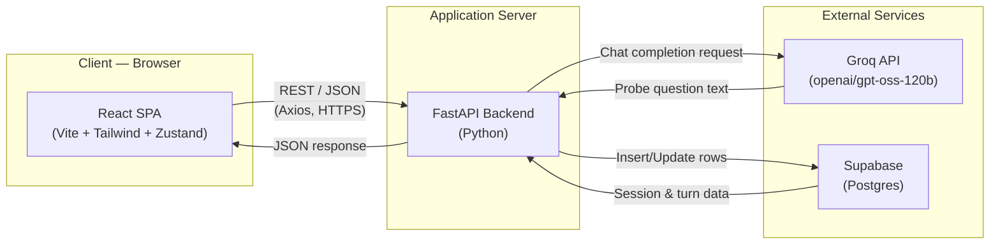

**Why this shape:** Routing every external call through the backend means the Groq and Supabase credentials never reach the browser, and all the "rules" of the product — never answer directly, escalate depth, detect frustration — live in one auditable place instead of being duplicable/bypassable from the client.

---

## 2. Low-Level Architecture

Zooming into the backend, the request path through a single chat turn touches four distinct service modules, each with one responsibility:

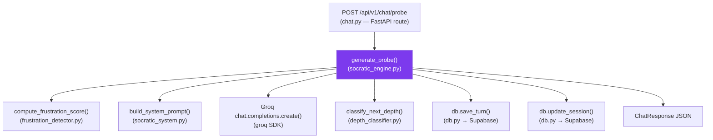

Each module is a pure-ish function or thin Supabase wrapper — there's no class hierarchy, no dependency injection framework, no ORM. This is intentionally simple: four small files, each independently readable in under a minute, composed by one orchestrator function (`generate_probe`).

---

## 3. Frontend Architecture

The frontend is a single-page app with **no router** despite `react-router-dom` being a listed dependency (it's installed but never imported anywhere in the source) — navigation between the two real "pages" is done by toggling a `screen` string (`'landing'` | `'chat'`) inside global Zustand state.

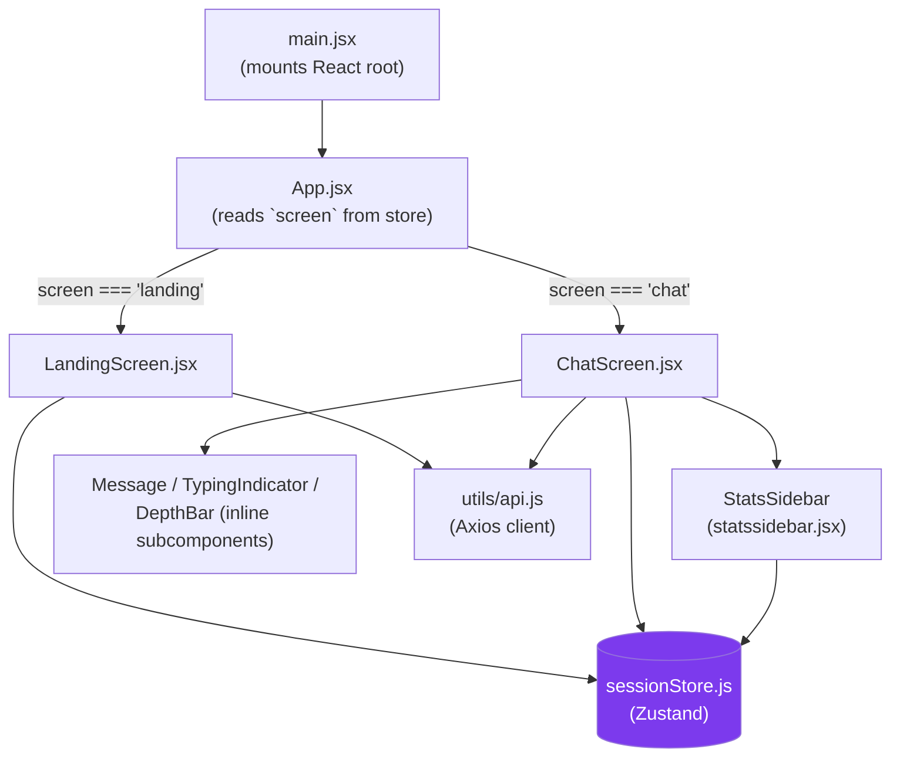

**Component responsibilities:**

| Component | Responsibility |
|---|---|
| `LandingScreen.jsx` | Collects topic + language, calls `POST /session/start`, stores the returned `session_id`, flips `screen` to `'chat'`. |
| `ChatScreen.jsx` | The main interactive surface — message thread, input box, the 8-level depth meter rail, session-complete handling, "New Session" reset. Contains three small inline subcomponents (`DepthBar`, `TypingIndicator`, `Message`) rather than separate files. |
| `statssidebar.jsx` (exported as `StatsSidebar`) | Read-only panel computing turn count, max depth, average word count, and a "thinking quality" percentage — entirely derived from existing Zustand state, no extra network calls. |
| `errorscreen.jsx` (exports `ErrorScreen`) | Built, styled, and ready — but **not currently imported or rendered anywhere** in the component tree. It exists as dead code today. |
| `sessionStore.js` | The single source of truth for all client-side state (see §10). |
| `utils/api.js` | Thin Axios wrapper exposing `startSession()` and `getProbe()` — the only two backend calls the frontend currently makes. |

**Known build risk:** `ChatScreen.jsx` does `import StatsSidebar from './StatsSidebar'`, but the file on disk is named `statssidebar.jsx` (all lowercase). This resolves fine on case-insensitive filesystems (Windows, macOS) but will very likely **fail on a case-sensitive Linux build** — which matters because `main.py`'s CORS config already names a Vercel production URL, implying Linux-based deployment is the actual target.

---

## 4. Backend Architecture

The backend is a FastAPI app with three router modules registered in `main.py`, each scoped to a tag and (for two of them) a `/api/v1` prefix:

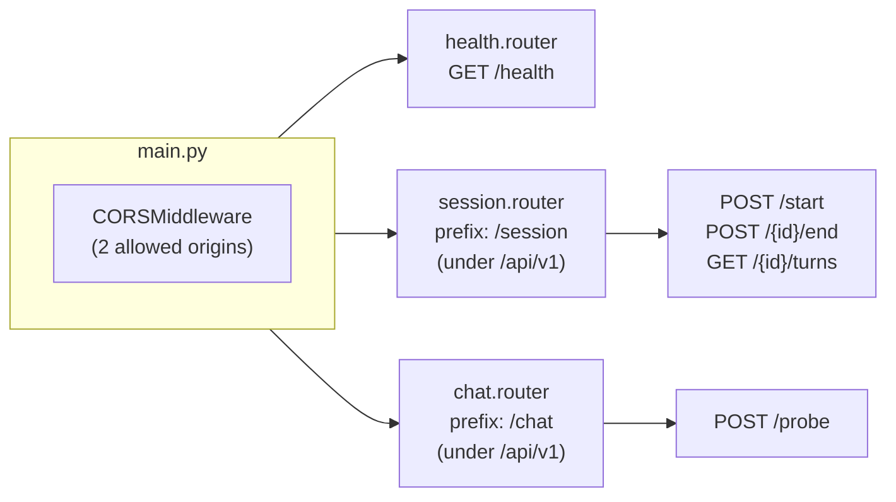

Routes are thin — they validate the request body via Pydantic models, delegate to a service function, and return a typed response model. No route contains business logic itself; that all lives in `app/services/`.

**Notable gap:** no route, anywhere, wraps its service call in a `try/except`. If Groq times out, the API key is invalid, or Supabase is unreachable, FastAPI's default exception handling takes over and a raw 500 with a Python traceback is returned to the client. This is consistent across all five endpoints and is the single biggest backend resilience gap in the system today.

**Unused-but-built endpoints:** `POST /session/{id}/end` and `GET /session/{id}/turns` exist and are fully implemented, but the frontend's `api.js` never calls either of them. They appear to be built ahead of a future feature (likely session history/resume) rather than dead code to remove.

---

## 5. AI Architecture

This is the system's core intellectual property. The AI behavior is governed entirely by a system prompt rebuilt fresh on every single turn — there is no fine-tuning, no embeddings, no retrieval, no agentic tool use. It is a single-call, prompt-engineered chat completion, made deterministic-feeling through external (non-LLM) state tracking.

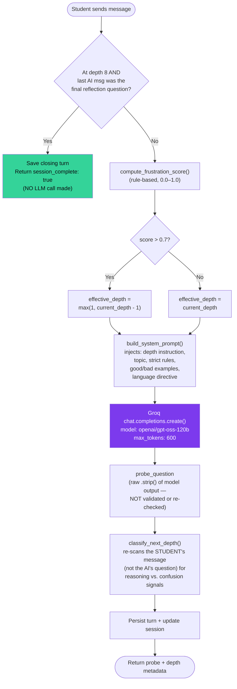

**The 8 depth levels** (defined in `socratic_system.py`, each pairing a name with an instruction injected into the system prompt):

| # | Name | Instruction given to the model |
|---|---|---|
| 1 | Clarification | Ask the student to define or clarify exactly what they mean. |
| 2 | Assumptions | Identify a hidden assumption in the student's statement and probe it directly. |
| 3 | Evidence | Ask the student to provide evidence or logical justification. |
| 4 | Viewpoints | Push the student to consider an opposing or alternative perspective. |
| 5 | Implications | Ask the student to reason about the logical consequences of their position. |
| 6 | Meta-Inquiry | Ask the student to reflect on why this question/concept matters at all. |
| 7 | Connections | Ask the student to connect this concept to something else they know. |
| 8 | Reflection | Ask exactly what they understood/learned — the final question of the session. |

**Critical design point — the depth classifier and the LLM are decoupled.** The next depth level is *not* derived from what the AI asked; it's computed by re-reading the **student's** message for reasoning-connector phrases ("because", "therefore", Kannada equivalents) combined with a 15-word minimum, or regression phrases ("I don't know", "just tell me"). A fallback rule nudges depth up automatically every 3rd turn regardless of content, to keep sessions moving. This means the system's perception of "how well is the student reasoning" is entirely separate from — and runs in parallel to — the LLM call that generates the actual question.

**Frustration detection** (`frustration_detector.py`) is a separate, additive scoring function: high-frustration phrases add 0.4 each, medium add 0.2, low add 0.05, consecutive short responses add 0.1 each, and any message under 4 words adds a flat 0.15 — capped at 1.0. This score only affects the *current* turn's effective depth (soften by one level above 0.7); it does not persist or accumulate across turns beyond what `consecutiveShortResponses` already tracks on the frontend.

**No output validation exists.** The model's raw text response is trusted as-is — there is no check confirming it's actually a single question, under the requested word count, or that it didn't slip into answering directly. The system prompt's "good/bad example" pair is the only enforcement mechanism, and it's purely a prompting technique, not a code-level guarantee.

**Unbounded context growth.** `conversation_history` is never trimmed, summarized, or windowed — every turn sends the *entire* prior conversation back to Groq. Long sessions get progressively slower and more expensive, with no graceful handling if the model's context window is eventually exceeded.

---

## 6. Database Architecture

There is no SQL migration file in the repository — the schema below is **inferred entirely from how `db.py` calls the Supabase client**, not confirmed against an actual `CREATE TABLE` statement. Treat column types as best-guess based on the Python values being inserted.

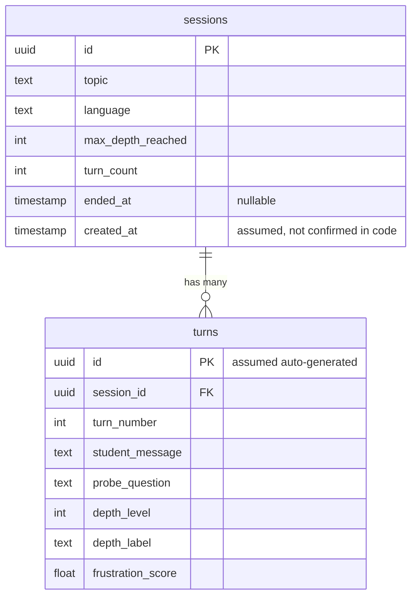

**Access pattern:** the backend uses a single module-level Supabase client (`db.py`), instantiated once at import time with the URL/key pulled from `Settings` (pydantic-settings, sourced from a `.env` file). All five database operations (`create_session`, `save_turn`, `update_session`, `end_session`, `get_session_turns`) are synchronous calls through the Supabase Python SDK — there's no connection pooling logic visible because the SDK handles that internally over HTTP (Supabase's client talks to a REST/PostgREST layer, not a raw Postgres socket).

**Unverified/undocumented:** whether Row Level Security (RLS) policies exist on either table, whether `session_id`/`turn_number` are indexed, and the exact data retention policy for student conversation content.

---

## 7. Component Communication

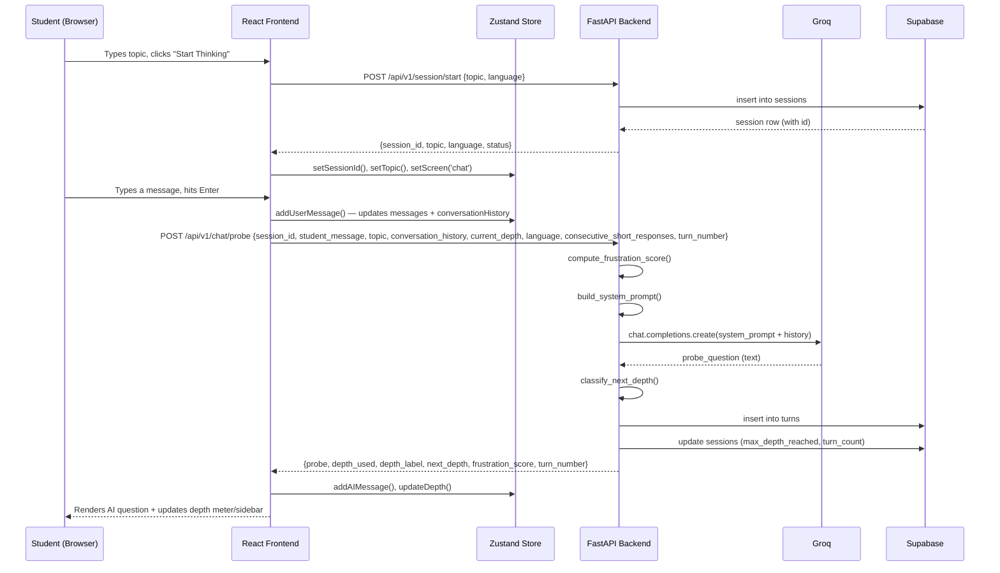

This is the complete, two-call lifecycle of a typical session start plus one turn. Every subsequent student message repeats only the second half (`POST /chat/probe` onward).

---

## 8. Request Lifecycle

Tracing a single `POST /api/v1/chat/probe` request from wire to wire:

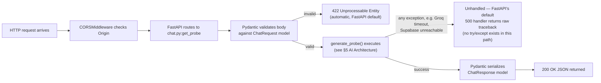

The validation step (Pydantic, automatic) is the only structured error handling that exists anywhere in this path. Everything past that point is unguarded.

---

## 9. Session Lifecycle

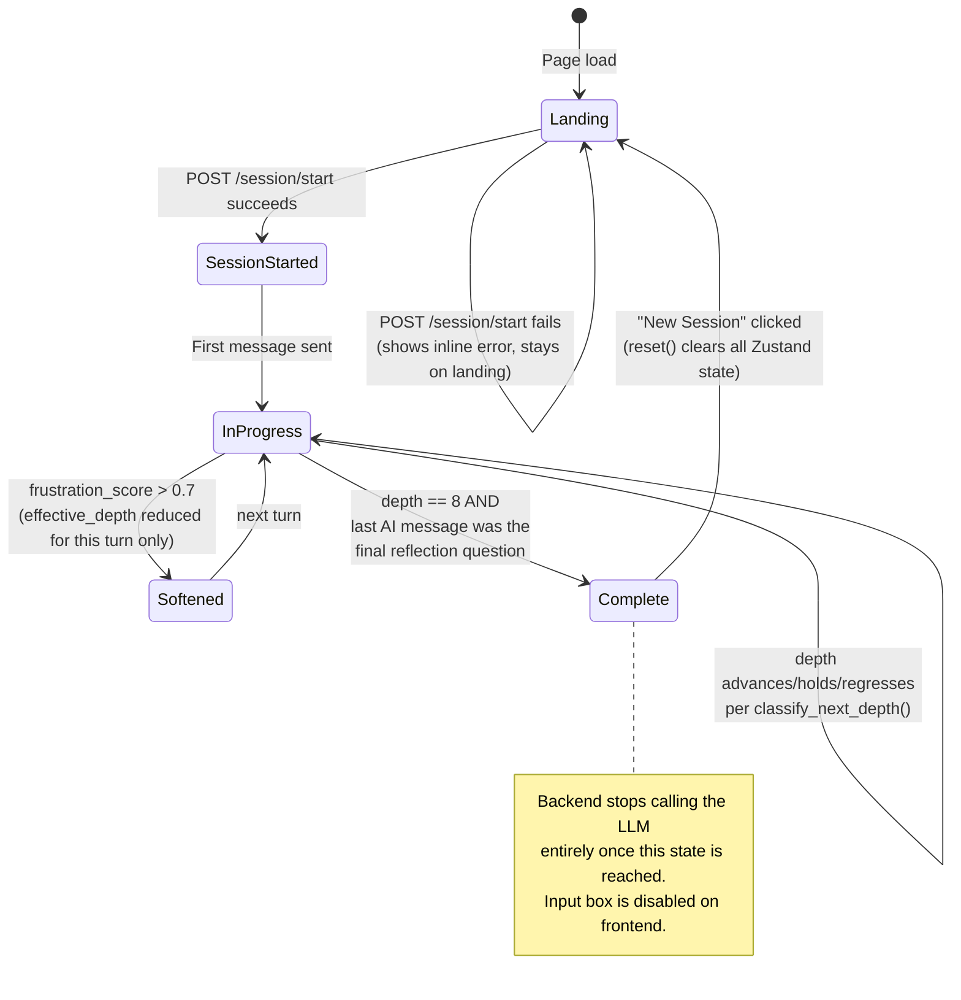

Note that "session end" in the product sense (reaching depth 8 and answering the reflection question) is **distinct** from the backend's `POST /session/{id}/end` endpoint, which sets `ended_at` in the database — that endpoint is never actually called by the frontend today, so `ended_at` is presumably always `null` for every session created through normal use.

---

## 10. State Management

All client state lives in one flat Zustand store (`sessionStore.js`) — there is no Context API usage, no Redux, no per-component local state for anything that needs to persist across components (only ephemeral UI state like the input textbox value or a loading boolean stays in local `useState`).

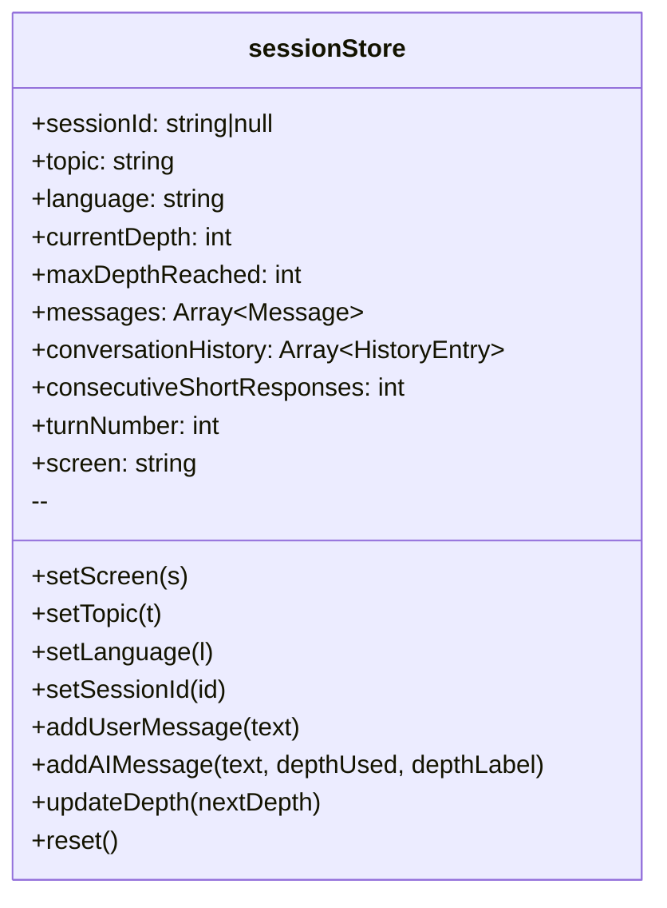

**Two parallel arrays, by design:** `messages` (rich objects with `role`, `text`, and for AI messages `depthUsed`/`depthLabel` — used for rendering) and `conversationHistory` (minimal `{role, content}` pairs — the exact shape the backend/LLM expects). They're kept in sync inside the same `addUserMessage`/`addAIMessage` actions rather than derived from one another, which is a reasonable simplicity-over-DRY tradeoff but means any future change to message shape has to update both arrays consistently.

**No persistence layer.** Everything lives in memory only — a page refresh, tab close, or crash loses the entire conversation and depth progress, since there's no `localStorage`, `sessionStorage`, or URL-based session recovery wired up (despite the backend having a `GET /session/{id}/turns` endpoint that *could* support exactly this kind of recovery).

---

## 11. Error Flow

This section documents what *actually happens* today when things go wrong, not what should happen.

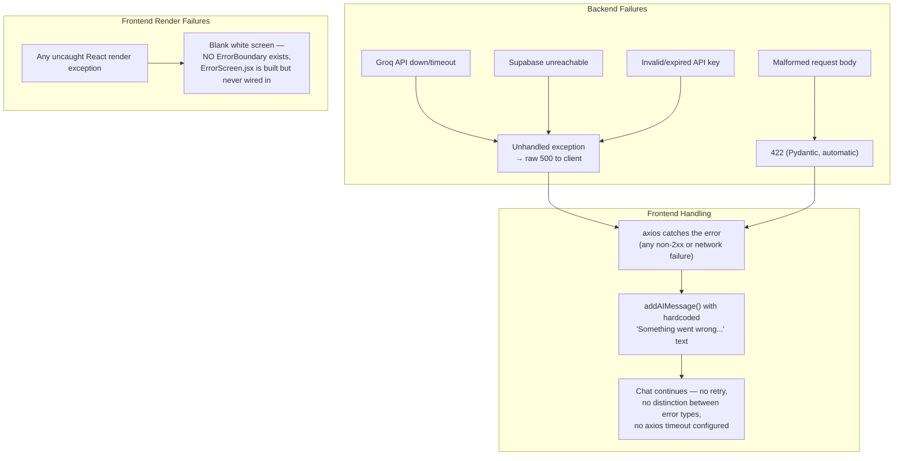

**Key takeaway for a new engineer:** the frontend's error handling is a single catch-all — every backend failure, regardless of cause (LLM down, DB down, bad input, network blip), surfaces as the identical generic message inside the chat thread. There's no way for the UI to currently distinguish "the AI service is down" from "your session expired" from "the server crashed."

---

## 12. Deployment Topology

This is the least-documented part of the actual system, and worth being explicit about what is and isn't knowable from the code alone.

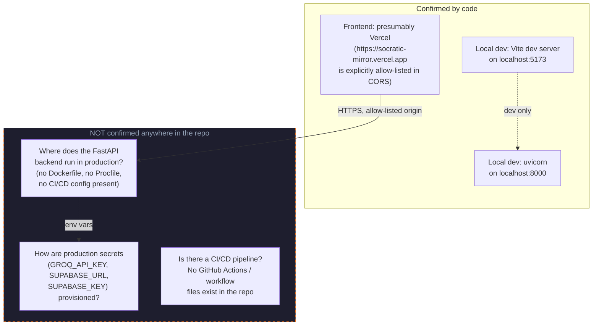

There is no `Dockerfile`, no `Procfile`, no `vercel.json`, no GitHub Actions workflow, and no infrastructure-as-code anywhere in the repository. The single piece of hard evidence about production deployment is the hardcoded Vercel URL in `main.py`'s CORS allowlist — everything else about how/where the backend is actually hosted, how environment variables reach it, and whether any deployment automation exists is genuinely unknown from the code and needs to be confirmed with the team before being documented as fact.

---

## Summary for the Onboarding Engineer

The system is small enough to hold in your head completely: two services, five backend routes, six frontend source files that matter, and one prompt-engineering file that *is* the product. The architecture is intentionally simple — no message queues, no microservices, no caching layer, no ORM — which is appropriate for its current scale, but means several production-hardening concerns (error handling, rate limiting, auth, input validation) are not yet addressed anywhere in the stack and should be treated as known, not hidden, gaps as the project matures.
