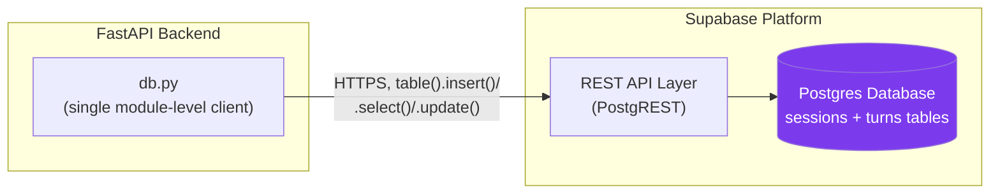
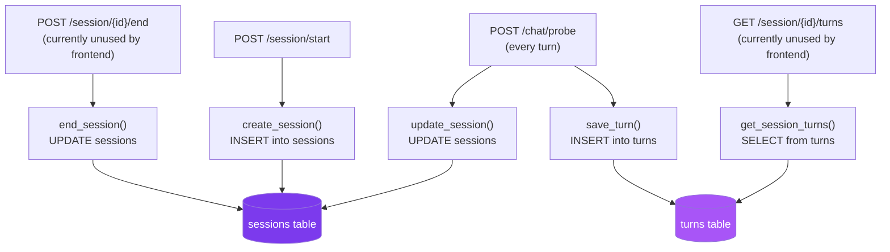
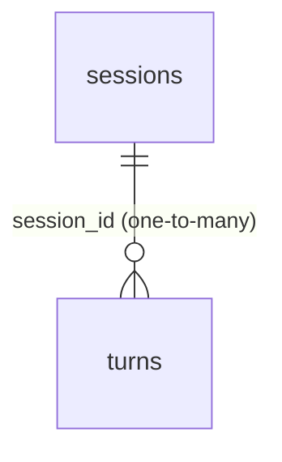
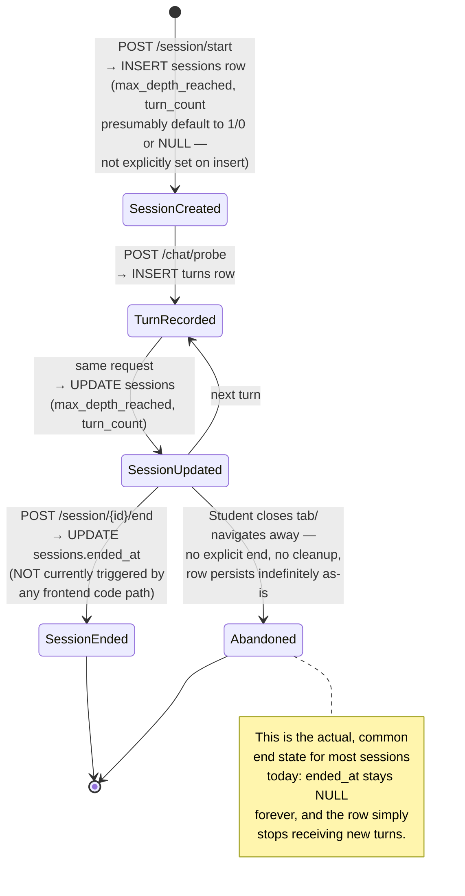
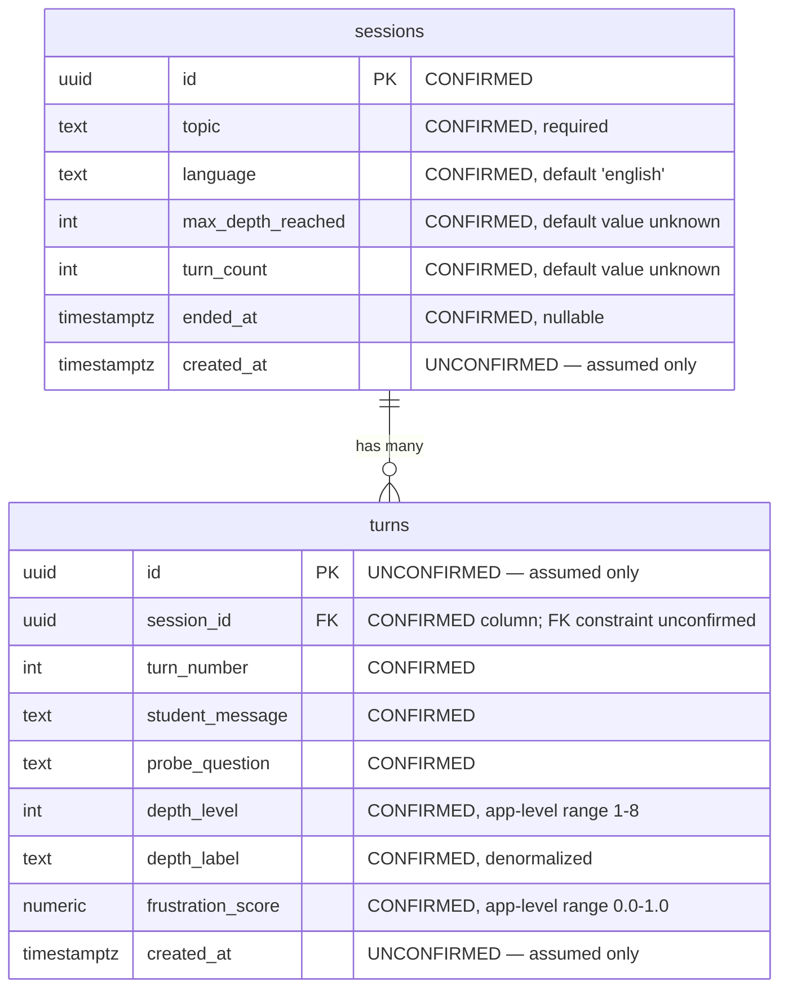
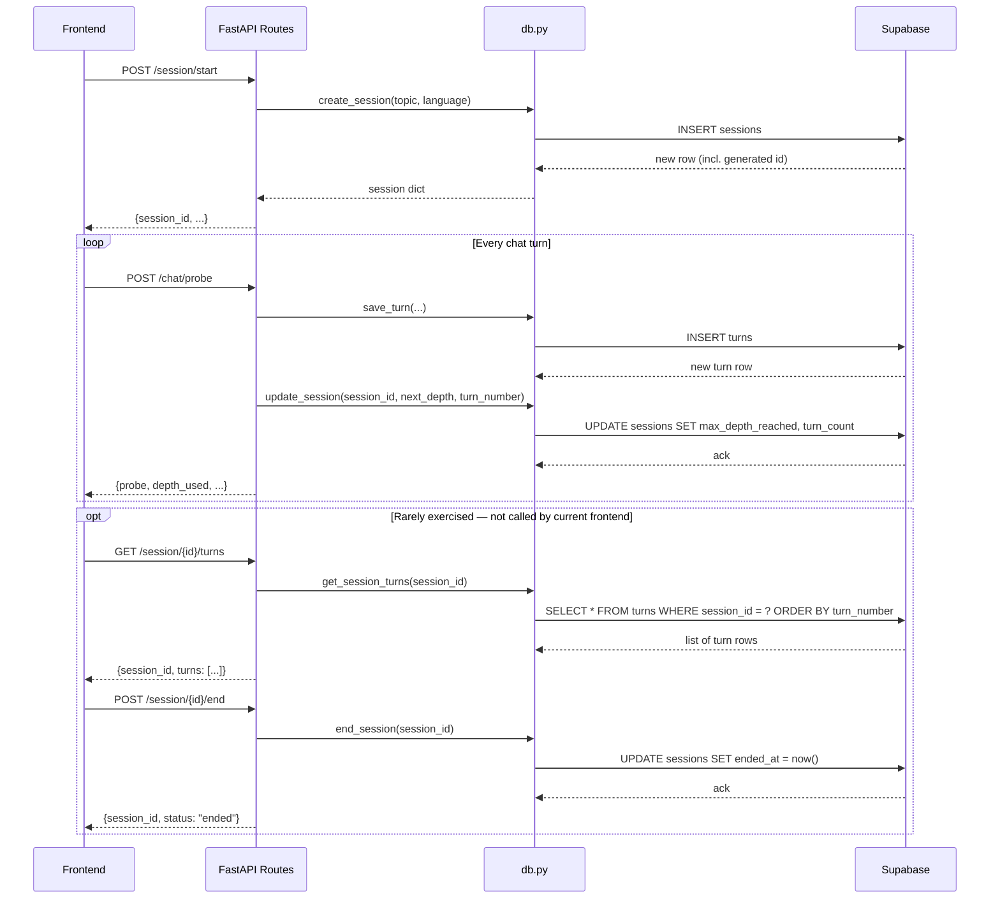

# Database Documentation — Socratic Mirror

## 1. Introduction

Socratic Mirror's persistence layer is intentionally small: two tables, accessed through five functions in a single file (`backend/app/services/db.py`), with no ORM, no migration tooling, and no SQL files anywhere in the repository. This document describes the database **as it is used by the code** — every table, column, and constraint claimed below is either directly observable from a `db.py` function call, or explicitly marked as inferred where the repository does not provide direct confirmation. This distinction matters more here than in most database documentation, because there genuinely is no schema file in this codebase to check claims against; everything about the live schema is reconstructed from how the Python code talks to it.

## 2. Database Architecture

The database is Supabase — a hosted Postgres platform accessed not via a raw database connection (no `psycopg2`, no SQLAlchemy engine, no connection string with host/port/user/password) but through Supabase's own Python client library, which talks to a PostgREST-style HTTP API layer in front of the actual Postgres instance.



The client is created exactly once, at module import time:

```python
supabase: Client = create_client(settings.supabase_url, settings.supabase_key)
```

This single client instance is then reused by every function in the module for the lifetime of the backend process — there is no per-request client creation, no explicit connection pooling logic in this codebase (pooling, if it happens at all, is handled internally by the Supabase client/PostgREST layer, not by anything visible here), and no async database calls (every Supabase call in this file is synchronous, even though the FastAPI route handlers calling into `db.py` are themselves defined as regular `def`, not `async def` — consistent with each other, but meaning this backend does not currently take advantage of FastAPI's async request-handling capabilities at all).

## 3. Why Supabase Was Chosen

The repository contains no design-decision document explaining this choice explicitly, so the reasoning below is inferred from the technology's characteristics relative to this project's actual needs, not stated anywhere as fact by the original developers:

- **Managed Postgres with zero infrastructure setup.** For a student internship project with a tight timeline, avoiding self-hosting or managing a database server is a meaningful time saver — Supabase provides a production-grade Postgres instance behind a simple client library with no DevOps overhead.
- **Generous free tier.** Consistent with the project's other cost-conscious choice (Groq over a paid-per-token frontier model API), Supabase's free tier is a natural fit for a project with no monetization and uncertain usage volume.
- **A REST-like client API instead of raw SQL.** The `supabase.table("sessions").insert({...})` style used throughout `db.py` is quick to write and reads almost like the data structure it's manipulating, lowering the barrier for contributors who may be more comfortable with this style than writing raw SQL or learning an ORM like SQLAlchemy.
- **Built-in auth and real-time capabilities, currently unused.** Supabase also offers row-level auth integration and real-time subscriptions — neither is used anywhere in this codebase today (confirmed: no `supabase.auth` calls, no `.on('postgres_changes', ...)` subscriptions), but their availability may have been a factor in the original choice if the team anticipated needing them later (e.g., for a "watch your session live" feature, or user accounts).

## 4. Database Flow

The five functions in `db.py` are the *only* way the application ever touches the database — there is no other module, script, or admin path that reads or writes these tables.



In a typical, fully-used session, the write pattern is: one `INSERT` into `sessions` at the start, then one `INSERT` into `turns` plus one `UPDATE` to `sessions` on *every single chat turn* until the session reaches its natural conclusion (depth 8, reflection answered). There is no `DELETE` operation anywhere in the codebase — no function in `db.py` ever removes a row from either table.

## 5. Sessions Table

Represents one tutoring session — one topic, one language, one continuous conversation from landing-screen start through depth-8 completion (or abandonment).

**Written by:** `create_session()` (insert), `update_session()` (update), `end_session()` (update).
**Read by:** Implicitly via `result.data[0]` returned from `create_session()`'s insert — there is no standalone "get session by id" read function anywhere in `db.py`. The only way session metadata is ever read back is the row returned at creation time.

| Column | Inferred Type | Source in Code |
|---|---|---|
| `id` | `uuid` (assumed; Supabase's default primary key type) | Read as `session["id"]` in `session.py` after `create_session()` |
| `topic` | `text` | Written directly from `CreateSessionRequest.topic` |
| `language` | `text` | Written directly from `CreateSessionRequest.language`, defaults to `"english"` |
| `max_depth_reached` | `integer` | Written by `update_session()`, called every turn with the classifier's `next_depth` |
| `turn_count` | `integer` | Written by `update_session()`, called every turn with the current `turn_number` |
| `ended_at` | `timestamptz`, nullable | Written only by `end_session()`, an endpoint never called by the frontend today — in practice, this column is presumed to remain `NULL` for effectively every session created through normal product use |
| `created_at` | `timestamptz` (assumed) | **Not written or read anywhere in the application code** — assumed to exist only because it is Supabase's near-universal default convention for tables, not because any code in this repository references it |

## 6. Turns Table

Represents one exchange within a session: the student's message and the AI's resulting probe question, plus the depth/frustration metadata computed for that turn.

**Written by:** `save_turn()` (insert only — confirmed, no update function exists for this table).
**Read by:** `get_session_turns()`, via the (currently frontend-unused) `GET /session/{id}/turns` endpoint.

| Column | Inferred Type | Source in Code |
|---|---|---|
| `id` | `uuid` (assumed primary key) | Never referenced directly by application code — inferred only as a default Supabase convention |
| `session_id` | `uuid` (assumed foreign key to `sessions.id`) | Written directly in `save_turn()`; used as the filter in `get_session_turns()`'s `.eq("session_id", ...)` |
| `turn_number` | `integer` | Written directly from the request payload; used as the sort key in `get_session_turns()`'s `.order("turn_number")` |
| `student_message` | `text` | The raw student input for this turn, written verbatim — no sanitization or length limit applied before storage |
| `probe_question` | `text` | The AI-generated question (or closing message) for this turn, written verbatim |
| `depth_level` | `integer` | The *effective* depth level used to generate this turn's question (i.e., `effective_depth`, possibly softened by frustration — not necessarily equal to the depth the student was nominally "at") |
| `depth_label` | `text` | Human-readable name corresponding to `depth_level` (e.g., `"Evidence"`), denormalized — stored as plain text rather than looked up via a join to some levels table, since no such table exists |
| `frustration_score` | `float`/`numeric` (assumed) | The 0.0–1.0 score computed for this specific turn by `compute_frustration_score()` |

**Notably absent from this table:** there is no `created_at`/timestamp column referenced anywhere for individual turns — meaning there is currently no way to know, from the database alone, *when* (wall-clock time) any given turn actually happened, only its relative order via `turn_number`. If `created_at` exists as a Supabase default, it's simply never read by this application.

## 7. Relationships



One `sessions` row relates to zero or more `turns` rows via `turns.session_id` referencing `sessions.id`. This is a textbook one-to-many relationship, and the application code's access pattern is consistent with it being enforced as a foreign key (filtering turns by `session_id` and never the reverse) — but **whether an actual `FOREIGN KEY` constraint exists at the database level is not confirmed anywhere in this codebase**, since there is no SQL/migration file to check. It is entirely possible the live Supabase table only has an unconstrained `uuid`/`text` column that happens to be used as if it were a foreign key, with no referential integrity actually enforced by Postgres itself.

## 8. Column Descriptions

This section consolidates every column referenced across both tables into one place, with a plain-language description of what each one means in product terms (not just its type), for quick lookup by anyone writing a query.

**sessions**
- `id` — the unique identifier for a tutoring session, generated by Supabase on insert and returned to the client as `session_id`. This is the value every subsequent `/chat/probe` call must include.
- `topic` — the free-text subject the student chose to explore (e.g., "Photosynthesis"). Echoed into every LLM system prompt for this session's duration.
- `language` — `"english"` or `"kannada"` by product convention, though the database/API layer enforces neither value specifically (any string is accepted and stored).
- `max_depth_reached` — the highest depth level (1–8) the student has reached so far in this session; updated on every turn, used by the frontend's stats sidebar to show a "thinking quality" percentage.
- `turn_count` — the total number of chat turns so far in this session.
- `ended_at` — when the session was explicitly closed via `/session/{id}/end`; in practice, almost always `NULL` since that endpoint is unused by the current frontend.

**turns**
- `session_id` — links this turn back to its parent session.
- `turn_number` — this turn's position within the session, starting at 1.
- `student_message` — exactly what the student typed for this turn, unmodified.
- `probe_question` — exactly what the AI asked back (or the closing message, on the final terminating turn), unmodified.
- `depth_level` — which of the 8 cognitive depth levels was actually used to generate this turn's question.
- `depth_label` — the human-readable name for `depth_level`, stored redundantly alongside the numeric value for read convenience.
- `frustration_score` — how frustrated/disengaged the student appeared to be on this specific turn, 0.0 (none) to 1.0 (maximum).

## 9. Data Lifecycle



**No data ever expires or is deleted.** There is no TTL, no scheduled cleanup job, no archival process, and no `DELETE` statement anywhere in the codebase. Every session and every turn ever created persists in the database indefinitely, by default, for as long as the Supabase project exists.

## 10. CRUD Operations

A direct mapping of every database operation the application is capable of performing, with **Create/Read/Update/Delete** explicitly called out per table:

| Table | Create | Read | Update | Delete |
|---|---|---|---|---|
| `sessions` | `create_session()` — `POST /session/start` | None — no standalone "get session" function exists | `update_session()` (every turn) and `end_session()` (`POST /session/{id}/end`, currently unused) | **None — no delete capability exists anywhere in the codebase** |
| `turns` | `save_turn()` — every `POST /chat/probe` call | `get_session_turns()` — `GET /session/{id}/turns`, currently unused by the frontend | **None — turns are immutable once written; no update function exists** | **None — no delete capability exists anywhere in the codebase** |

This is a notably write-heavy, read-light, and entirely non-destructive set of operations as currently implemented — the application can create and append data, and update two specific fields on `sessions`, but has no built-in mechanism to read a session's own metadata back after creation, nor to ever remove anything.

## 11. SQL Schema (Inferred)

**No SQL file exists anywhere in this repository.** The schema below is a best-effort reconstruction based purely on the columns referenced in `db.py`, written in standard Postgres DDL for someone needing to provision a fresh Supabase project. Every line is marked according to confidence:

```sql
-- ============================================================
-- INFERRED SCHEMA — reconstructed from application code only.
-- No migration file exists in the repository. Column types,
-- constraints, defaults, and indexes below are best-effort
-- guesses based on usage patterns, NOT confirmed facts.
-- ============================================================

CREATE TABLE sessions (
    id                 uuid PRIMARY KEY DEFAULT gen_random_uuid(),  -- CONFIRMED: referenced as session["id"]
    topic              text NOT NULL,                               -- CONFIRMED: required field, written directly
    language           text NOT NULL DEFAULT 'english',             -- CONFIRMED: written directly, default matches Pydantic model default
    max_depth_reached  integer,                                     -- CONFIRMED: written by update_session(); default value at insert time UNKNOWN — create_session() never sets it explicitly, so this may rely on a database-level DEFAULT or remain NULL until the first turn
    turn_count         integer,                                     -- CONFIRMED: written by update_session(); same caveat as above re: initial value
    ended_at           timestamptz,                                 -- CONFIRMED: nullable, written only by end_session()
    created_at         timestamptz DEFAULT now()                    -- UNCONFIRMED: never referenced by any application code; included only as a standard Supabase/Postgres convention guess
);

CREATE TABLE turns (
    id                 uuid PRIMARY KEY DEFAULT gen_random_uuid(),  -- UNCONFIRMED: never referenced by application code; assumed default convention
    session_id         uuid NOT NULL REFERENCES sessions(id),       -- CONFIRMED (column existence + usage); FOREIGN KEY constraint itself is UNCONFIRMED — application behavior is consistent with one existing, but cannot be verified without schema access
    turn_number        integer NOT NULL,                            -- CONFIRMED: written directly, used as sort key
    student_message    text NOT NULL,                               -- CONFIRMED: written directly, no length constraint observed in application code
    probe_question     text NOT NULL,                               -- CONFIRMED: written directly
    depth_level        integer NOT NULL,                            -- CONFIRMED: written directly, application-level valid range is 1-8 but NOT enforced via CHECK constraint (unconfirmed whether one exists at DB level)
    depth_label        text NOT NULL,                               -- CONFIRMED: written directly, denormalized copy of depth_level's name
    frustration_score  numeric NOT NULL,                            -- CONFIRMED: written directly as a Python float, 0.0-1.0 range enforced only in application code (min(1.0, ...)), NOT confirmed as a DB-level CHECK constraint
    created_at         timestamptz DEFAULT now()                    -- UNCONFIRMED: never referenced by any application code; included only as a standard convention guess
);

-- Indexes: NONE are confirmed to exist. The following are
-- recommended based on actual query patterns observed in db.py,
-- but are NOT confirmed to be present in the live database:
-- CREATE INDEX idx_turns_session_id ON turns(session_id);
-- CREATE INDEX idx_turns_session_turn ON turns(session_id, turn_number);
```

## 12. Mermaid ER Diagram



## 13. Mermaid Data Flow Diagram



## 14. Security Considerations

- **No Row Level Security (RLS) confirmation.** Whether RLS policies are configured on either table in the live Supabase project cannot be determined from this codebase. Given that the backend uses what is presumably a single shared key (not a per-user/per-session credential — there is exactly one `supabase_key` in `Settings`), if RLS is *not* configured, the key in use likely has broad read/write access to both tables, limited only by whatever the application code chooses to query — meaning the database itself provides no defense-in-depth beyond what `db.py` happens to implement.
- **No ownership model.** Neither table has any concept of "which user/client created this row" beyond the implicit fact that whoever holds a `session_id` can act on it. Combined with the API layer's complete lack of authentication (documented in `docs/API.md`), this means database-level security is currently entirely dependent on `session_id`s being hard to guess (they are presumed to be UUIDs, which are infeasible to brute-force, but are not treated as secrets anywhere — e.g., they could end up in browser history, logs, or shared links).
- **Sensitive content stored in plain text, indefinitely.** `student_message` stores exactly what a student typed, unencrypted, in the same Postgres database as everything else, with no retention policy or deletion path — relevant given this is an education product that may see use by minors, where even seemingly benign conversational content can include personal context students share while thinking aloud.
- **No input length limits before storage.** Since neither the API layer (`docs/API.md` §request validation) nor (as far as can be determined) the database schema enforces a maximum length on `student_message`, `probe_question`, or `topic`, there is no technical barrier preventing pathologically large values from being written.
- **Service-role vs. anon key is unclear.** Supabase distinguishes between a public "anon" key (intended to be used with RLS policies restricting access) and a "service role" key (which bypasses RLS entirely). Which kind of key `settings.supabase_key` actually is cannot be determined from this codebase — this materially changes the actual security posture and should be confirmed directly with whoever provisioned the Supabase project.

## 15. Limitations

1. **No confirmed schema.** Every type, constraint, default, and index discussed in this document beyond what's directly read/written by `db.py` is inference, not fact, due to the complete absence of a migration file in the repository.
2. **No referential integrity guarantee verifiable from code.** The `sessions`-to-`turns` relationship behaves like a foreign key in application logic but is not confirmed to be enforced as one at the database level.
3. **No delete capability.** Data accumulates forever; there is no mechanism in the application to remove a session or its turns, whether for user-requested deletion, GDPR-style right-to-erasure compliance, or simple storage hygiene.
4. **No update capability for turns.** Once written, a turn row can never be corrected or amended by the application — if a bug ever wrote bad data to a turn, there is no code path to fix it short of direct database access.
5. **No read function for a single session's own metadata.** There is no `get_session(session_id)` equivalent to `get_session_turns()` — the only place session metadata is ever returned to the application is the moment of creation.
6. **No timestamps on individual turns.** Without a confirmed/used `created_at` on `turns`, there's no way to analyze response latency, time-of-day usage patterns, or session duration from the data alone — only turn order is recoverable.
7. **No transactional guarantee between the two writes in `save_turn()`+`update_session()`.** These are two separate, sequential Supabase calls inside `generate_probe()`, not wrapped in any explicit database transaction — if the process crashes or a network call fails between them, a turn could be saved without the session's `max_depth_reached`/`turn_count` being updated to match, leaving the two tables briefly (or permanently, if not retried) inconsistent with each other.
8. **No automated tests for the database layer.** Confirmed via the repository's empty `backend/tests/` directory — none of the five functions in `db.py` have any test coverage today.

## 16. Future Improvements

These follow directly from the limitations above and are documented as possibilities, not commitments:

- **Add an actual SQL migration file** (or adopt a migration tool such as Supabase's own CLI migrations, or Alembic) to the repository, turning the schema from inferred-from-usage into an explicit, version-controlled artifact — this alone would resolve the majority of "unconfirmed" markers throughout this document.
- **Add a `get_session(session_id)` read function** and corresponding endpoint, so session metadata can be retrieved independent of the creation response.
- **Wrap `save_turn()` + `update_session()` in an explicit transaction** (or a single Postgres function/RPC call via Supabase) to eliminate the inconsistency risk described above.
- **Add `created_at` to `turns` and ensure it's actually read/used**, enabling latency and usage-pattern analysis that's currently impossible.
- **Define and enforce explicit CHECK constraints** at the database level for `depth_level` (1–8) and `frustration_score` (0.0–1.0), rather than relying solely on application code to keep these values in range.
- **Introduce a data retention policy and deletion capability** — even a simple scheduled job to purge sessions older than some threshold, plus an explicit "delete my data" capability, would meaningfully improve the privacy posture of an education-facing product storing free-text student input indefinitely.
- **Confirm and document RLS policy status and key type** (anon vs. service role) explicitly, since this materially affects the actual security posture and is currently unknown from the codebase alone.
- **Add indexes explicitly** (`session_id` on `turns`, at minimum) as part of a migration file rather than hoping Supabase's defaults or manual dashboard configuration cover the access patterns the application actually uses.
