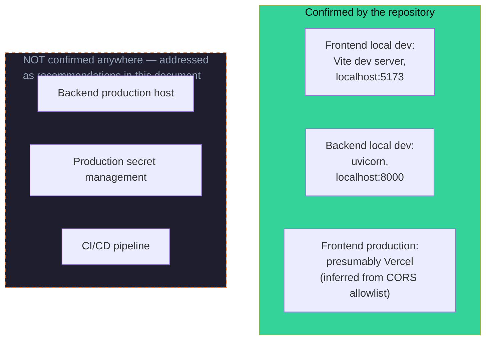
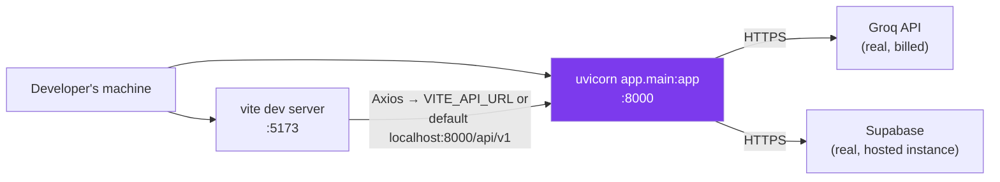
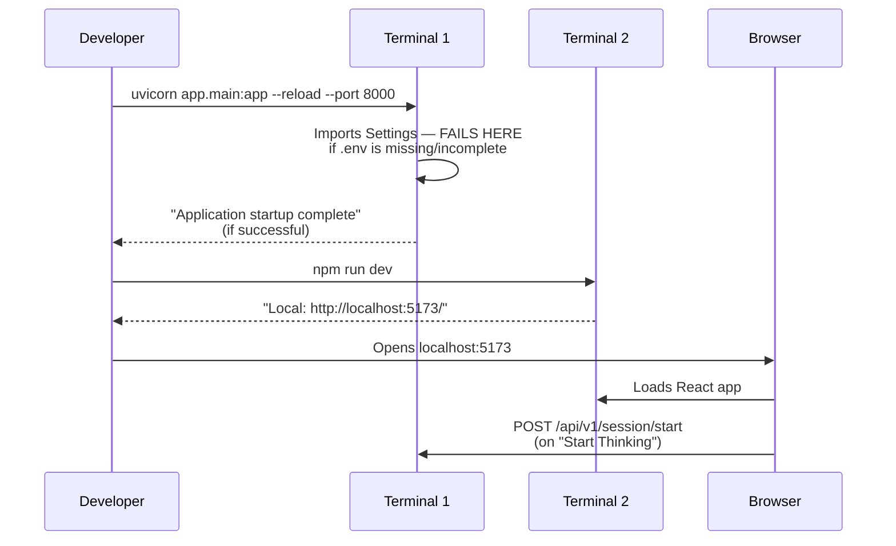
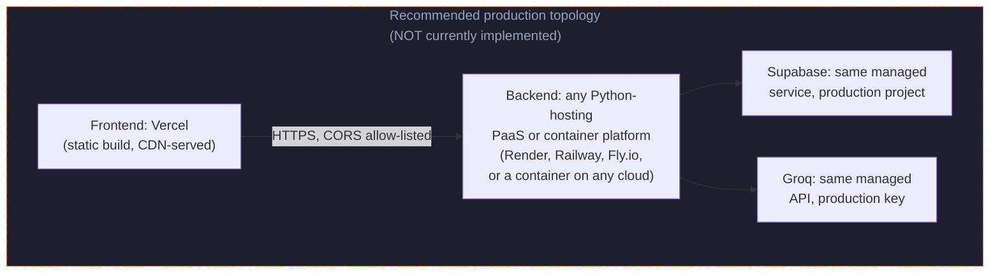
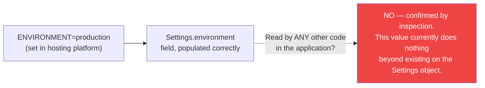

# Deployment Guide — Socratic Mirror

## 1. Introduction

This document is the practical counterpart to `docs/System-Design.md` §22 (Deployment Architecture), which already establishes the central fact about this system's deployment posture: **there is no Dockerfile, no Procfile, no CI/CD workflow, and no infrastructure-as-code anywhere in the repository.** That section exists to analyze what that absence means for the system as a whole. This document exists to do something different — to give an engineer a working, step-by-step path to running Socratic Mirror locally today, and an honest, clearly-labeled set of recommendations for getting it into production, distinguishing throughout between **what is confirmed by the repository** and **what is a recommendation this document is introducing, not a documented fact about the existing system.**

Every command and configuration value in §3–§8 (local development) is derived directly from the actual source — `backend/app/core/config.py`, `backend/requirements.txt`, `frontend/package.json`, `frontend/vite.config.js`, and `main.py`'s CORS configuration. Every recommendation in §9–§12 (production) is exactly that — a recommendation consistent with the technology choices already documented in `docs/Architecture.md` and `docs/Database.md`, not a description of an existing, working production setup, because no such setup is described anywhere in this codebase.

## 2. Deployment Overview

The system has two independently deployable pieces — the React frontend and the FastAPI backend — plus two managed external services that require no deployment of their own (Groq and Supabase are both consumed purely as APIs). The only piece of hard evidence about an *intended* production topology anywhere in the repository is the hardcoded CORS allowlist entry in `backend/app/main.py`:

```python
allow_origins=[
    "http://localhost:5173",   # React dev server
    "https://socratic-mirror.vercel.app",  # Production frontend
]
```

This single line is the entire confirmed deployment story for the frontend (Vercel, by strong inference from the domain). Nothing in the repository confirms where the backend runs, how its environment variables reach it in production, or whether any deployment automation exists at all — already established as a known gap in `docs/Architecture.md` §12 and `docs/System-Design.md` §22, and not re-litigated here.



## 3. Local Development Setup

Local development is a two-process setup: the FastAPI backend (via `uvicorn`) and the Vite dev server, run independently, talking to each other over `http://localhost`. There is no `docker-compose.yml` or any single command that starts both — each must be started in its own terminal session, as walked through in §8.



Worth flagging plainly before going further: **there is no local mock or stub for either Groq or Supabase anywhere in this codebase.** Running the backend locally means making real calls against a real Groq account (consuming real, if free-tier, quota) and a real Supabase project. There is no offline or sandboxed development mode — a working Groq API key and a working Supabase project are hard prerequisites for the backend to function at all, not just for production use.

## 4. Prerequisites

Derived directly from `backend/requirements.txt` and `frontend/package.json`:

| Requirement | Why it's needed | Source |
|---|---|---|
| Python 3.x with `pip` | Backend runtime | `backend/requirements.txt` |
| Node.js + npm | Frontend build tooling (Vite, React 19) | `frontend/package.json` |
| A Groq account and API key | Required by `Settings.groq_api_key` — the backend will fail to start without it (see §7) | `backend/app/core/config.py` |
| A Supabase project, URL, and key | Required by `Settings.supabase_url` / `supabase_key` — same failure mode | `backend/app/core/config.py` |
| The `sessions` and `turns` tables provisioned in that Supabase project | The application performs no migrations itself — these tables must already exist before any request will succeed | `docs/Database.md` §11 |

No specific Python or Node version is pinned anywhere in the repository (no `.python-version`, no `engines` field in `package.json`, no `runtime.txt`) — this document does not invent a specific version requirement that the codebase itself doesn't declare. A reasonably current Python 3.10+ and Node 18+ are safe assumptions given the dependency versions in `requirements.txt` (e.g., `fastapi==0.137.1`, `pydantic==2.13.4`) and `package.json` (React 19, Vite 8), but this is a recommendation based on those dependencies' own requirements, not a fact stated anywhere in this repository.

**The Supabase schema itself must be created manually.** Since `docs/Database.md` §11 already establishes that no SQL migration file exists in the repository, setting up a fresh Supabase project for local development requires manually creating the `sessions` and `turns` tables using that document's inferred schema (`docs/Database.md` §11's `CREATE TABLE` statements) as a starting point — these statements are explicitly marked there as best-effort reconstructions, not a confirmed, ready-to-run migration.

## 5. Backend Setup

```bash
cd backend

# Create and activate a virtual environment (recommended, not enforced by the repo)
python -m venv .venv
source .venv/bin/activate    # Windows: .venv\Scripts\activate

# Install dependencies exactly as pinned
pip install -r requirements.txt
```

The backend's entry point is `app/main.py`, a standard FastAPI `app` object with no custom startup/shutdown event handlers (confirmed by direct inspection — no `@app.on_event` decorators exist anywhere in `main.py`). There is nothing to initialize beyond what already happens at import time: the Supabase client (`db.py`) and the Groq client (`socratic_engine.py`) are both constructed once, at module import, directly from `Settings` — meaning **if either `GROQ_API_KEY` or the Supabase settings are missing or malformed, the backend will fail immediately at import/startup time**, before it ever serves a single request, rather than failing lazily on the first request that needs them. This is a direct consequence of `pydantic_settings.BaseSettings` requiring `groq_api_key`, `supabase_url`, and `supabase_key` as non-optional fields in `Settings` (`backend/app/core/config.py`) — there are no defaults for any of the three.

## 6. Frontend Setup

```bash
cd frontend
npm install
```

No further setup step exists — there is no code generation, no build step required before development (Vite serves directly from source), and no environment file is strictly required, since `frontend/src/utils/api.js` falls back to a hardcoded default if `VITE_API_URL` is unset:

```javascript
const API = axios.create({
  baseURL: import.meta.env.VITE_API_URL || 'http://localhost:8000/api/v1',
  ...
})
```

This means the frontend will work out of the box against a locally-running backend on the default port with zero environment configuration — only deviating from that default (a different backend host/port, or pointing at a deployed backend) requires setting `VITE_API_URL` explicitly, covered in §7.

## 7. Environment Variables

The backend's environment variables are defined by `Settings(BaseSettings)` in `backend/app/core/config.py`, sourced from a `.env` file in the `backend/` directory (`class Config: env_file = ".env"`). This `.env` file is git-ignored (confirmed in the repository's `.gitignore`: `.env` and `.env.local` are both excluded) — meaning **no real credentials are present anywhere in version control**, and every engineer setting up the project locally must create this file themselves.

| Variable | Required | Default | Used by |
|---|---|---|---|
| `GROQ_API_KEY` | Yes | None — startup fails without it | `socratic_engine.py`, at module import |
| `SUPABASE_URL` | Yes | None — startup fails without it | `db.py`, at module import |
| `SUPABASE_KEY` | Yes | None — startup fails without it | `db.py`, at module import |
| `ENVIRONMENT` | No | `"development"` | Defined on `Settings` but **never read anywhere else in the codebase** — confirmed by inspection of every other source file; this value is accepted but currently has no observable effect on behavior |

Example `backend/.env` (values illustrative, never real secrets):

```bash
GROQ_API_KEY=gsk_xxxxxxxxxxxxxxxxxxxxxxxxxxxxxxxx
SUPABASE_URL=https://xxxxxxxxxxxxxxxxxxxxx.supabase.co
SUPABASE_KEY=eyJxxxxxxxxxxxxxxxxxxxxxxxxxxxxxxxxxxxxxxxx
ENVIRONMENT=development
```

The frontend has exactly one environment variable, sourced through Vite's standard `import.meta.env` mechanism, optionally set in a `frontend/.env` file:

| Variable | Required | Default | Used by |
|---|---|---|---|
| `VITE_API_URL` | No | `http://localhost:8000/api/v1` | `frontend/src/utils/api.js` |

**Which Supabase key type is expected is not documented anywhere in the codebase.** As already flagged in `docs/Database.md` §14, whether `SUPABASE_KEY` should be the public "anon" key (intended for use with Row Level Security policies) or the "service role" key (which bypasses RLS) is not stated anywhere — this materially affects the security posture of whatever Supabase project is connected and should be confirmed deliberately, not assumed, when provisioning either a local or production Supabase project.

## 8. Running the Project

Two terminals, two long-running processes, started independently:

**Terminal 1 — backend:**
```bash
cd backend
uvicorn app.main:app --reload --port 8000
```
The `--reload` flag is a local-development convenience (auto-restarts on source changes) and is not something the repository specifies as required — it is this document's recommendation for local iteration speed, consistent with how any standard FastAPI project is typically run during development.

**Terminal 2 — frontend:**
```bash
cd frontend
npm run dev
```
This invokes the `dev` script defined in `frontend/package.json` (`"dev": "vite"`), starting the Vite dev server on its default port, `5173` — matching the exact origin already hardcoded into the backend's CORS allowlist (§2), so no further CORS configuration is needed for this specific default setup.



**Verifying the setup works**, in order of increasing confidence:

```bash
# 1. Confirm the backend process is alive at all
curl http://localhost:8000/

# 2. Confirm the health endpoint responds (still doesn't check Groq/Supabase — see System-Design.md §21)
curl http://localhost:8000/health

# 3. The only real end-to-end check: actually start a session
curl -X POST http://localhost:8000/api/v1/session/start \
  -H "Content-Type: application/json" \
  -d '{"topic": "Test Topic", "language": "english"}'
```

Step 3 is the only command above that actually exercises the Supabase connection — steps 1 and 2 will return `200` even if Supabase credentials are entirely wrong, since neither endpoint touches the database (already established in `docs/API.md`'s notes on both endpoints). A failure at step 3 with a `500` is the expected symptom of a misconfigured `SUPABASE_URL`/`SUPABASE_KEY`, an unprovisioned `sessions` table, or an invalid `GROQ_API_KEY` (since `generate_probe()` is never reached for `/session/start`, a failure here specifically isolates Supabase rather than Groq).

## 9. Production Deployment

Everything in this section is a **recommendation**, written to be consistent with the technologies and constraints already established across `docs/Architecture.md`, `docs/Database.md`, and `docs/System-Design.md` — not a description of any production setup that exists today. No production deployment of this system is described, configured, or scripted anywhere in the repository.



The frontend half of this recommendation is the *least* speculative — the CORS allowlist's `https://socratic-mirror.vercel.app` entry is strong direct evidence the original team already deployed (or planned to deploy) the frontend to Vercel, so §11 treats that part as a near-certainty rather than a from-scratch recommendation. The backend half is the genuinely open question, addressed in §10.

## 10. Backend Hosting

Because no Dockerfile, Procfile, or platform-specific configuration file exists anywhere in the repository, this document cannot describe an "intended" backend host — only options consistent with the backend's actual shape (a standard, single-process, synchronous FastAPI app with no special infrastructure dependencies beyond outbound HTTPS to Groq and Supabase, per `docs/System-Design.md` §6 and §18).

Three realistic options, none confirmed as the project's actual choice:

| Option | Fit | Caveat |
|---|---|---|
| A general-purpose PaaS (Render, Railway, Fly.io) | Good fit — these platforms run a `uvicorn`/`gunicorn` process directly from a `requirements.txt` with minimal configuration, matching this backend's simplicity | None of these platforms are referenced anywhere in the repository; this is a recommendation, not a confirmed choice |
| A containerized deployment (Docker on any cloud provider) | Would require writing a `Dockerfile` from scratch — none exists today | Adds an artifact this repository currently lacks entirely |
| A traditional VM with `uvicorn`/`gunicorn` behind a reverse proxy (e.g., nginx) | Works, but requires the most manual operational setup of the three options, with no automation to lean on | Most divergent from the project's current "minimal infrastructure" philosophy (`docs/System-Design.md` §3) |

Whichever option is chosen, two facts from earlier documents directly constrain it: the backend is **fully synchronous and single-process** (`docs/System-Design.md` §6), so the chosen host needs to run it behind a process manager that can supervise (and ideally run multiple workers of) a standard ASGI app — e.g., `uvicorn app.main:app --workers N` or `gunicorn -k uvicorn.workers.UvicornWorker`, neither of which is configured anywhere in the repository today; and the backend is **fully stateless between requests** (`docs/System-Design.md` §13), meaning, in principle, horizontal scaling behind a load balancer is straightforward once a hosting choice is made, even though nothing in the repository currently does this.

## 11. Frontend Hosting

Given the strong evidence already discussed (§2, §9), Vercel is the most consistent recommendation. The build is a standard static Vite output:

```bash
cd frontend
npm run build    # runs `vite build`, defined in package.json
```

This produces a static `dist/` directory (git-ignored, per the repository's `.gitignore`) that any static host (Vercel, Netlify, a static S3+CDN setup, etc.) can serve directly — there is no server-side rendering, no Node.js runtime required in production for the frontend itself, since the entire app is a client-side React SPA (`docs/Architecture.md` §3). The one production-specific configuration needed is setting `VITE_API_URL` (§7) at build time to point at wherever the backend ends up hosted (§10) — without this, a production build would silently default to `http://localhost:8000/api/v1`, which would obviously be unreachable from a deployed frontend and would surface as the generic "Something went wrong" error already documented in `docs/Architecture.md` §11.

## 12. Environment Configuration

Production environment configuration follows the same three required backend variables and one optional frontend variable already tabulated in §7 — there is no separate "production" schema, no environment-specific `Settings` subclass, and no distinct production configuration file anywhere in the codebase. The only behavioral difference the codebase itself defines between environments is the `ENVIRONMENT` setting's *existence* — and, as already noted in §7, that value is read into `Settings` but never actually consulted anywhere else in the application, meaning setting `ENVIRONMENT=production` today would have **zero effect on runtime behavior** (no debug-mode toggling, no different CORS origins, no different logging verbosity) — this is a real gap between what the variable's name implies and what the code actually does with it.



**The CORS allowlist is hardcoded, not environment-driven.** `main.py`'s `allow_origins` list is a literal Python list of two strings — there is no `ENVIRONMENT`-based branching, and no environment variable controls which origins are allowed. Deploying the backend to a new frontend domain (e.g., a staging Vercel preview URL, or a custom domain) requires editing and redeploying `main.py` itself, not setting a configuration value.

## 13. Security Considerations

Most security facts relevant to deployment are already established in `docs/System-Design.md` §17 (overall security architecture) and `docs/Database.md` §14 (database-specific). This section is scoped specifically to deployment-time actions an operator should take, given those already-documented gaps:

- **Never commit `.env` files.** Already enforced by `.gitignore`, but worth restating as a deployment-time discipline: production secrets (`GROQ_API_KEY`, `SUPABASE_URL`, `SUPABASE_KEY`) must be set directly in the hosting platform's secret/environment management, never written into any tracked file.
- **Confirm the Supabase key type before deploying to production.** As flagged in §7 and `docs/Database.md` §14, whether `SUPABASE_KEY` is an anon key (RLS-dependent) or a service-role key (RLS-bypassing) materially changes the actual security posture of the production database — this should be a deliberate, confirmed choice at deployment time, not an inherited default from local development.
- **Be aware that no authentication or rate limiting exists at the application layer** (`docs/System-Design.md` §17) — anything resembling production hardening against abuse (a malicious actor running up Groq costs, scraping session transcripts via guessable `session_id`s) currently has to come from infrastructure outside this codebase (e.g., a reverse proxy or platform-level rate limiter), since the application itself provides none.
- **Restrict CORS to only the actual production frontend origin(s)** before going live — the current allowlist already does this correctly for the one known production origin, but any additional frontend deployment (a staging environment, a preview URL) would need its own explicit entry, since there is no wildcard or pattern-matching CORS configuration in use.
- **Treat the absence of HTTPS enforcement in application code as the hosting platform's responsibility.** Nothing in `main.py` or anywhere else in the backend enforces HTTPS-only traffic — this is expected to be handled by whatever reverse proxy or platform terminates TLS in front of the application, consistent with how most PaaS platforms operate, but worth confirming explicitly for whichever option from §10 is actually chosen.

## 14. Troubleshooting

A practical table of symptoms an engineer is likely to encounter, mapped to their most probable cause based on the codebase's actual behavior (not generic troubleshooting advice):

| Symptom | Likely Cause | Where to look |
|---|---|---|
| Backend fails to start immediately, before serving any request | `.env` missing or incomplete — `GROQ_API_KEY`, `SUPABASE_URL`, or `SUPABASE_KEY` not set | §7 — these three fields have no defaults in `Settings` |
| `GET /` and `GET /health` both return 200, but `/api/v1/session/start` returns 500 | Supabase misconfiguration — wrong URL/key, or the `sessions` table doesn't exist yet | §8's step-3 isolation check; `docs/Database.md` §11 |
| `/session/start` succeeds, but `/api/v1/chat/probe` returns 500 | Groq misconfiguration — invalid API key, model unavailable, or quota exhausted | `docs/AI-Design.md` §15's "no retry logic, no fallback model" |
| Frontend shows "Could not connect to server" on the landing screen | Backend not running, wrong `VITE_API_URL`, or a CORS rejection | §6, §7, §2's CORS allowlist |
| Frontend's `ChatScreen.jsx` shows "Something went wrong" mid-conversation | Any backend 500 — could be Groq, Supabase, or a malformed `current_depth` (`docs/Prompt-Engineering.md` §6) | `docs/Architecture.md` §11's Error Flow — this generic message cannot distinguish the cause |
| A production build fails to import `StatsSidebar` | The known case-sensitivity bug — `ChatScreen.jsx` imports `'./StatsSidebar'` but the file is `statssidebar.jsx` (all lowercase) | `docs/Architecture.md` §3's "Known build risk" — this will pass on case-insensitive local filesystems (macOS, Windows) and fail on case-sensitive Linux build environments, which most production hosts use |
| Session never reaches "complete" state in the UI, even after the reflection question is answered | The confirmed `session_complete` field contract bug — silently dropped by the `ChatResponse` Pydantic model | `docs/API.md` and `docs/System-Design.md` §11 — this is a code defect, not a deployment misconfiguration, and won't be fixed by any environment change |
| Kannada responses unexpectedly come back in English | `language` value sent to the backend isn't the exact lowercase string `"kannada"` | `docs/Prompt-Engineering.md` §12 — the match is case-sensitive and exact |

## 15. Deployment Checklist

A practical, ordered checklist for taking this system from a clean clone to a working production deployment, given the recommendations established in §9–§13:

1. Provision a production Supabase project; manually create the `sessions` and `turns` tables using `docs/Database.md` §11's inferred schema as a starting point, adjusting as needed since that schema is explicitly not a confirmed migration.
2. Decide deliberately whether the Supabase key used will be an anon key with RLS policies configured, or a service-role key — do not default to whichever key Supabase's dashboard surfaces first without considering the implications documented in §13.
3. Obtain a production Groq API key, separate from any key used in local development, so usage and cost can be tracked independently.
4. Choose a backend host from §10's options (or another consistent with the backend's stateless, synchronous, single-process shape) and deploy the `backend/` directory's contents, installing from `requirements.txt`.
5. Set `GROQ_API_KEY`, `SUPABASE_URL`, and `SUPABASE_KEY` as platform-managed secrets on the chosen backend host — never in a committed file.
6. Confirm the backend's CORS allowlist in `main.py` includes the actual production frontend origin before relying on it — edit and redeploy if the origin differs from the existing hardcoded Vercel URL.
7. Build the frontend (`npm run build`) with `VITE_API_URL` set to the production backend's actual URL, and deploy the resulting `dist/` output to Vercel (or another static host).
8. Run the same three-step verification from §8 (root, `/health`, then an actual `/session/start` call) against the production backend URL before considering the deployment complete — `/health` alone is insufficient, per §13 and `docs/System-Design.md` §21.
9. Manually exercise a full session end-to-end against production (start a session, send a message, confirm a probe question returns) — there is no automated smoke test in this repository to do this for you (`docs/System-Design.md` §24).
10. Decide explicitly on a logging/monitoring approach before going live, since none exists in the application itself (§16) — relying solely on `/health` will not detect a Groq or Supabase outage, as already established in `docs/System-Design.md` §21.

## 16. Monitoring

This section intentionally does not repeat `docs/System-Design.md` §20–§21's full analysis of the system's logging and monitoring gaps — that analysis stands as written. What this document adds is deployment-specific guidance: **whatever logging or monitoring this system ends up with will have to come entirely from outside the application code**, since none exists inside it. Concretely, that means relying on the chosen hosting platform's own request/process logs (most PaaS options from §10 provide these by default, capturing stdout — which is where uvicorn's default access logs and any unhandled traceback both land, per `docs/System-Design.md` §20) as the *only* available signal until logging is added to the application itself. An external uptime monitor pointed at `GET /health` can confirm the process is alive, but cannot, by the endpoint's own design (`docs/API.md`), confirm that Groq or Supabase are reachable or that `/chat/probe` actually works — this gap should be treated as a known, accepted limitation at deployment time, not something a generic uptime check silently covers.

## 17. Backup Strategy

There is no backup strategy described anywhere in this repository, and none is implemented at the application level — `docs/Database.md` §15 already establishes that there is no scheduled cleanup, no archival process, and no data retention policy of any kind in the application code. At the deployment level, this means whatever backup capability the production system has will come entirely from Supabase's own platform-level backup features (point-in-time recovery or scheduled backups, available on Supabase's paid tiers — not confirmed as enabled for this project, since the original team's choice of Supabase tier is not documented anywhere in this codebase) rather than from anything this application does itself. An operator deploying this system to production should treat enabling and verifying Supabase's own backup configuration as a deliberate, separate setup step — not something this document can confirm is already handled, and not something the application code will ever do on its own, since (per `docs/Database.md` §10) there is no `DELETE` capability in the codebase at all, meaning data loss risk in this system comes overwhelmingly from infrastructure failure or accidental schema changes, not from any destructive operation the application itself performs.

## 18. Future Deployment Improvements

These are documented possibilities, not commitments, consistent with how every other document in this set frames its own future-improvements section:

- **Add a `Dockerfile` for the backend**, turning the currently-undocumented hosting question (§10) into a portable, reproducible artifact that works identically across any container-capable host.
- **Add a CI/CD pipeline** (e.g., GitHub Actions) that runs on every push — even a minimal pipeline that just confirms `pip install -r requirements.txt` and `npm install && npm run build` succeed would catch real regressions (such as the known `StatsSidebar` case-sensitivity build failure documented in §14) before they reach production, something nothing in this repository currently does.
- **Make `ENVIRONMENT` actually do something.** As established in §12, this setting is currently read but never consulted — a natural improvement is using it to drive environment-specific behavior such as CORS origin selection (replacing the hardcoded allowlist), log verbosity, or enabling/disabling FastAPI's interactive docs (`/docs`, `/redoc`) in production.
- **Extend `/health` to perform real dependency checks** against Groq and Supabase, closing the gap repeatedly flagged in §13, §16, and `docs/System-Design.md` §21, where a "healthy" response currently guarantees nothing about the system's actual ability to serve its core feature.
- **Introduce application-level logging and a centralized aggregation target**, directly addressing §16 and the root-cause analysis in `docs/System-Design.md` §20, so that production incidents can be diagnosed from logs rather than from student-reported symptoms.
- **Document and enable Supabase's backup/PITR configuration explicitly** as part of the deployment checklist (§15), rather than leaving backup coverage as an unconfirmed assumption, per §17.
- **Move CORS origin and other environment-sensitive configuration out of hardcoded Python** and into environment variables, removing the need to edit and redeploy `main.py` every time a new frontend origin (e.g., a staging URL) needs to be allow-listed.
