# System Design — Socratic Mirror

## 1. Introduction

This document is the system-level synthesis of everything documented separately in `docs/Architecture.md`, `docs/AI-Design.md`, `docs/API.md`, `docs/Database.md`, and `docs/Prompt-Engineering.md`. Where those documents each go deep on one layer — the software architecture, the AI behavior, the HTTP contract, the persistence model, and the prompt construction, respectively — this document's job is to step back and describe Socratic Mirror as a single system: what it is for, how its pieces fit together, how data and control actually move through it end to end, and where the system's real engineering trade-offs and gaps live when viewed holistically rather than layer by layer.

This document does not re-derive detail already established elsewhere. Wherever a topic has a canonical home in a prior document, this document states the conclusion and points there for the full treatment, rather than repeating tables, code listings, or diagrams that already exist. The intent is that a new engineer can read this document first, end to end, to build a complete mental model of the system, and then dive into the five referenced documents on demand for implementation-level depth on any specific layer.

## 2. High-Level System Overview

Socratic Mirror is a three-tier web application: a React single-page frontend, a FastAPI backend that owns all business logic, and two external managed services — Groq (LLM inference) and Supabase (Postgres persistence) — that the backend talks to on the system's behalf. The frontend never communicates with Groq or Supabase directly; every external call is mediated by the backend. This shape, and the reasoning behind it, is established in `docs/Architecture.md` §1 and is treated as foundational throughout this document.

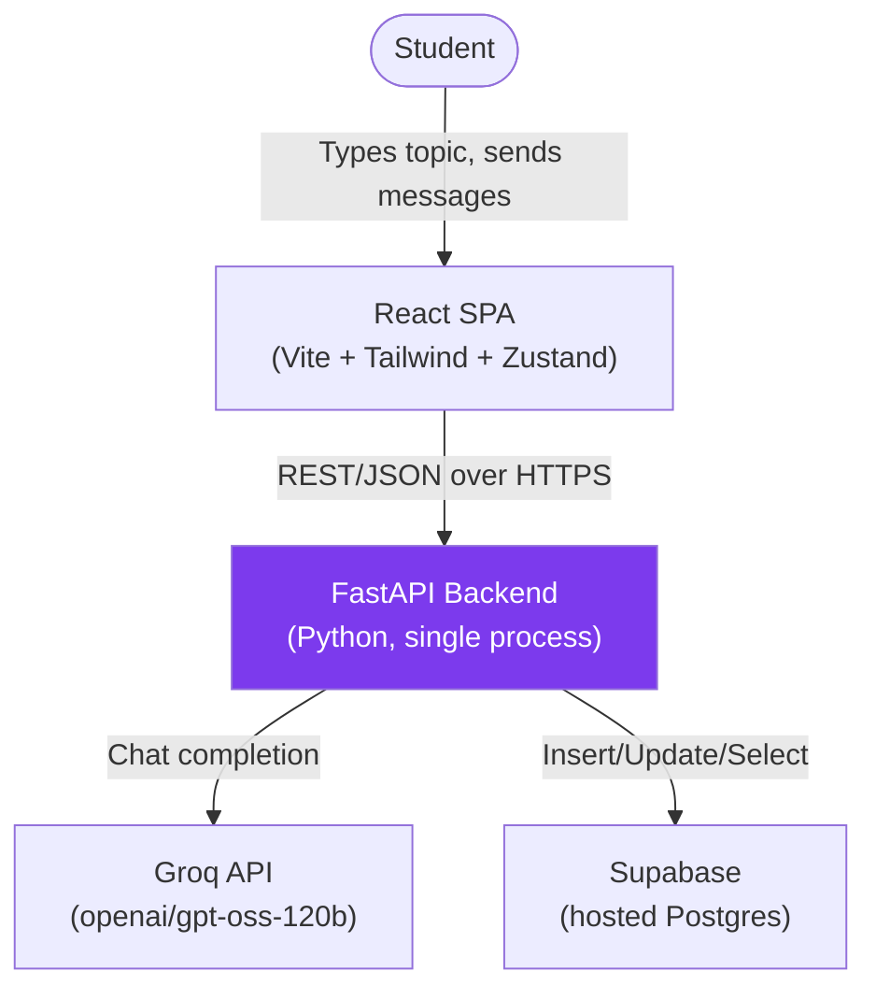

The product itself is a single-purpose conversational tutoring tool: a student names a topic, and an AI asks them an escalating sequence of questions about it across eight defined "cognitive depth levels," never directly answering. The full pedagogical rationale for this is documented in `docs/AI-Design.md` §2–§7; this document treats that rationale as given and focuses on how the system is built to deliver it.

## 3. System Objectives

Distilled from the codebase's actual behavior rather than from any external requirements document (none exists in this repository), the system has four operating objectives, in priority order:

1. **Never let the AI answer a question directly.** This is the product's entire reason to exist, enforced primarily through prompt design (`docs/Prompt-Engineering.md` §13–§14) and secondarily through structural code constraints (`docs/AI-Design.md` §16).
2. **Adapt the conversation to the individual student**, both in cognitive difficulty (the depth classifier) and emotional state (the frustration detector) — both documented exhaustively in `docs/AI-Design.md` §10–§11.
3. **Operate with minimal infrastructure and cost.** Every technology choice observable in the codebase — Groq's free tier over a paid frontier model, Supabase over self-hosted Postgres, no message queue, no caching layer, no container orchestration config — points toward a system optimized for near-zero operating cost at small scale, consistent with its apparent origin as a student/internship-scale project (`docs/Database.md` §3).
4. **Keep the system small enough to be understood completely.** As `docs/Architecture.md`'s closing summary states, the system is "small enough to hold in your head completely" — this is achieved by deliberately avoiding architectural patterns (microservices, an ORM, a dependency-injection framework, a queue) that would add structure at the cost of that completeness.

These four objectives are in tension with a fifth, unstated one — production hardening (auth, rate limiting, error resilience, observability) — which is consistently *not* present anywhere in the system. This tension is revisited in §17 through §21 and is the single biggest theme running through this entire document.

## 4. Overall Architecture

The complete component map, combining the frontend's internal structure (`docs/Architecture.md` §3), the backend's router structure (§4), and the AI/database layers (§5–§6) into one diagram:

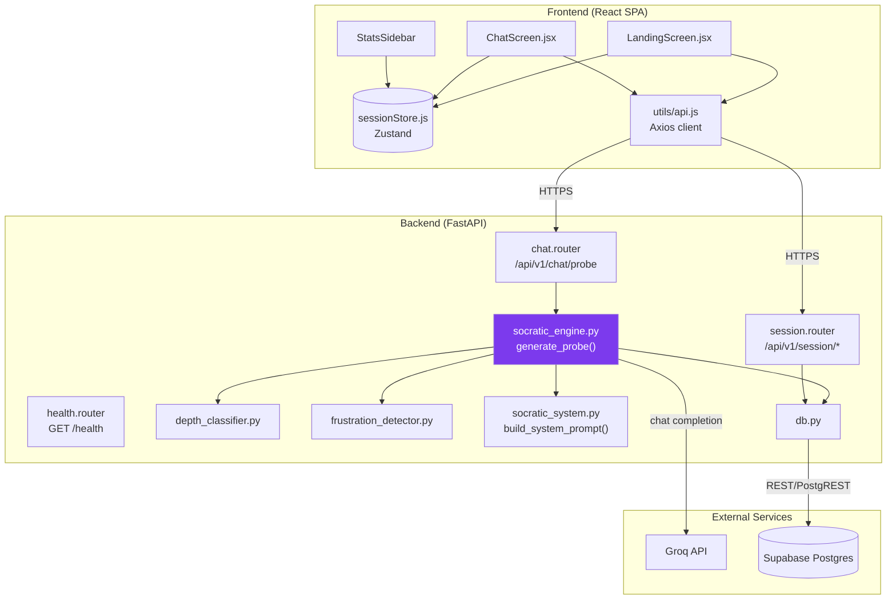

Every component in this diagram is documented in detail in an existing document: frontend components in `docs/Architecture.md` §3, backend routers in §4, the AI orchestration layer in `docs/AI-Design.md` §8 and `docs/Prompt-Engineering.md` §4–§6, and the database layer in `docs/Database.md` §2–§4. This document's contribution is the integrated view above and the cross-cutting analysis in the sections that follow.

## 5. Frontend Design

The frontend's component tree, routing-by-state-flag pattern, and known build risk (`StatsSidebar` import casing) are fully documented in `docs/Architecture.md` §3. At the system-design level, three properties of the frontend matter most for understanding the system as a whole:

**It is a thin client with no independent business logic.** Every consequential decision — what question to ask, what depth to move to, whether frustration is detected — happens server-side. The frontend's only "logic" is presentational (rendering depth bars, computing display-only statistics in `StatsSidebar` from already-known state) and one piece of client-tracked state that does influence backend behavior: `consecutiveShortResponses`, computed in `sessionStore.js` and sent to the backend as an input to frustration scoring (`docs/AI-Design.md` §10).

**All state is ephemeral and unrecoverable.** As documented in `docs/Architecture.md` §10, the entire session lives in in-memory Zustand state with no persistence layer on the client side — a refresh loses everything, even though the backend's database has a complete, recoverable record of the same session (`docs/Database.md` §6, §9), accessible via an endpoint (`GET /session/{id}/turns`) the frontend simply never calls (`docs/API.md`).

**The frontend is the only place a request can be aborted before reaching the backend**, via simple disabled-state guards (`sessionComplete`, `loading`, empty input) in `ChatScreen.jsx` — these are UX conveniences, not security or correctness boundaries, since the backend enforces none of them itself (see §17).

## 6. Backend Design

The backend's three-router structure, the absence of any `try/except` anywhere in the route layer, and the two built-but-unused endpoints are documented in `docs/Architecture.md` §4 and `docs/API.md`. At the system level, the defining characteristic of the backend is that it is **entirely synchronous and entirely single-process** — every route handler is a regular `def`, not `async def` (`docs/Database.md` §2), every Supabase call blocks, and the one LLM call per chat turn also blocks, with no background task queue, no worker pool, and no async I/O anywhere in the request path. This is revisited from a scalability angle in §18.

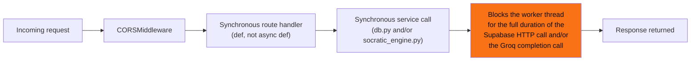

The backend's only structural concession to separating concerns is the four-module service split (`socratic_engine.py`, `depth_classifier.py`, `frustration_detector.py`, `socratic_system.py`) feeding into one orchestrator function, already diagrammed in `docs/Architecture.md` §2 — there is no further internal layering (no repository pattern beyond `db.py` itself, no service interfaces, no dependency injection).

## 7. AI Layer

The AI layer's complete design — the eight depth levels, frustration detection, depth classification, prompt construction, and LLM integration — is the subject of two entire dedicated documents (`docs/AI-Design.md` and `docs/Prompt-Engineering.md`) and is not repeated here. The one fact about the AI layer that matters most at the system-design level, worth stating plainly in this document specifically: **it is the system's only non-deterministic component, and its only externally-billed component.** Every other part of the request path — routing, validation, frustration scoring, depth classification, persistence — is free, deterministic, and fully reproducible Python logic; the single Groq call is the one place where the system's behavior is genuinely uncertain ahead of time, and the one place where every request has a direct dollar cost with no backend-side budget control (`docs/API.md`'s Security Notes for `/chat/probe`).

## 8. Database Layer

The two-table schema, the five-function `db.py` module, and the complete absence of a migration file are documented exhaustively in `docs/Database.md`. At the system-design level, the database's defining property is that it is accessed **exclusively over HTTP** (via Supabase's PostgREST-style client), never via a raw Postgres connection — meaning the backend has no connection pool of its own to tune, no prepared statements, and no transaction control beyond what Supabase's client API happens to expose (none is used; `docs/Database.md` §17 flags the resulting lack of atomicity between `save_turn()` and `update_session()` as a known consistency gap, restated here only because it is directly relevant to this document's data-flow discussion in §14).

## 9. Component Interaction

The full request/response sequence for a session start plus one chat turn is already diagrammed exhaustively in `docs/Architecture.md` §7 (sequence diagram) and §2 (component flowchart). This document's complementary view is a higher-level component-interaction diagram emphasizing *trust boundaries* — which is novel relative to prior documents and relevant to the security discussion in §17:

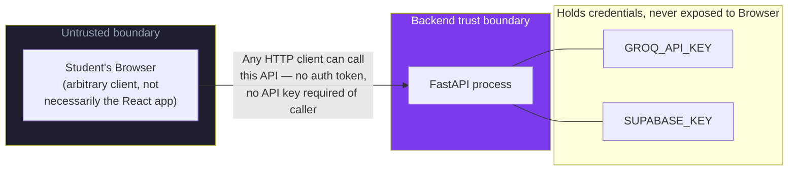

The architectural win of routing everything through the backend (`docs/Architecture.md` §1) is real — Groq and Supabase credentials genuinely never reach the browser. But the trust boundary between "browser" and "backend" is otherwise unguarded: nothing distinguishes the actual React frontend from any other HTTP client capable of constructing a valid JSON request (`docs/API.md`'s Authentication section: "None"). The credential boundary is solid; the client-identity boundary does not exist at all.

## 10. Request Lifecycle

The wire-to-wire lifecycle of the system's core request, `POST /api/v1/chat/probe`, is fully diagrammed in `docs/Architecture.md` §8 and `docs/API.md`'s endpoint-specific sequence diagram. The one addition worth making at the system level is a unified view spanning *all* endpoint types, since prior documents diagram individual endpoints separately:

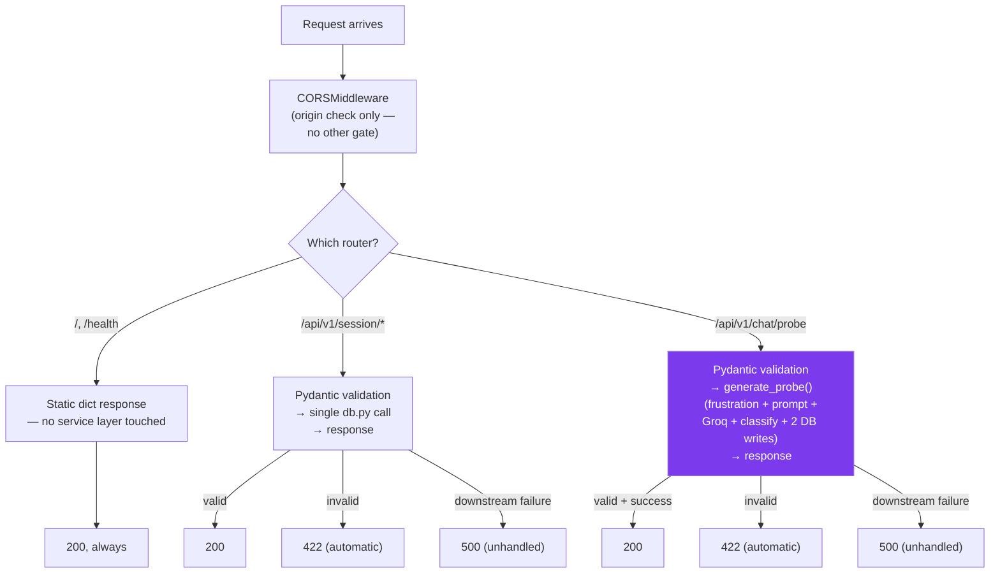

The structural point this diagram makes that no single-endpoint document makes explicitly: **every endpoint in the system funnels through the exact same two-outcome shape** — automatic Pydantic validation, then either a clean 200 or an unhandled 500 with no intermediate, application-defined error states anywhere. This uniformity is simple but means the *richness* of any given failure (a Groq timeout vs. a malformed `current_depth` vs. Supabase being down) is entirely lost by the time it reaches the client — already established per-endpoint in `docs/API.md`, restated here as a system-wide pattern, not an endpoint-specific quirk.

## 11. Response Lifecycle

Where §10 traces a request inward, this section traces the corresponding response back out, since no prior document treats this direction as its own topic. Two system-wide response behaviors matter:

**Only one endpoint has a typed response contract.** As established in `docs/API.md`'s Cross-Endpoint Observations, `POST /api/v1/chat/probe` is the only route with an explicit `response_model=`; every other route returns a bare dict. This means the *generation* of the response — what FastAPI/Pydantic actually serializes — varies in rigor across the system: most endpoints are exactly what the handler constructs in code, while `/chat/probe`'s response is filtered through a schema that can silently drop fields (the `session_complete` field, per `docs/API.md`'s detailed note on that exact contract mismatch).

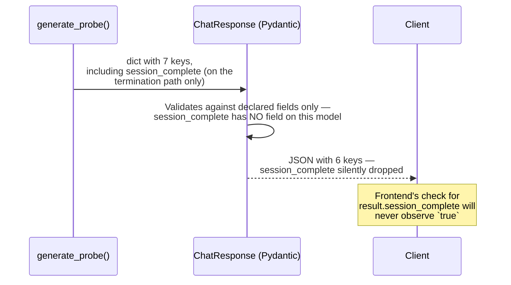

**No response is ever streamed.** Every response in the system, including the LLM-backed `/chat/probe` call, is a single, complete JSON payload sent only once the entire underlying chain of work has finished — already noted from the AI-integration angle in `docs/AI-Design.md` §15 ("No streaming"), restated here as a system-wide property: nothing in this codebase produces a partial or progressive response of any kind, at any layer.

## 12. Session Lifecycle

The full state-machine view of a session's lifecycle — from `Landing` through `InProgress`, optional `Softened` frustration states, to `Complete` — is diagrammed exhaustively in `docs/Architecture.md` §9, with the AI-specific sub-lifecycle (depth state transitions through all 8 levels) diagrammed separately in `docs/AI-Design.md` §14. This document does not reproduce either diagram; the relevant synthesis is that **these two lifecycles are not the same state machine, despite both governing "the same session."** The application-level lifecycle (`docs/Architecture.md` §9) tracks UI/session state (`landing` → `chat`, complete or not); the AI-level lifecycle (`docs/AI-Design.md` §14) tracks depth progression independently. They are coupled only through the `session_complete` signal — which, per §11 above, is currently broken in transit from backend to frontend, meaning in the *current, as-shipped* system, the frontend's `sessionComplete` UI state can only ever become `true` via a code path that, per the contract bug just described, never actually fires from a real server response. This is a genuine, system-level consequence of a bug documented piecemeal elsewhere (`docs/API.md`) but only fully visible when the two lifecycle diagrams are considered together, which is this section's contribution.

## 13. State Management

Client-side state management (the single flat Zustand store, its two parallel `messages`/`conversationHistory` arrays, its total lack of persistence) is documented completely in `docs/Architecture.md` §10. Server-side, there is no equivalent in-memory state at all — the backend is, by design, fully stateless between requests: every piece of context a turn needs (`current_depth`, `conversation_history`, `consecutive_short_responses`, `turn_number`) is supplied fresh by the client on every single call, with the database serving only as a write-behind log, never as a read-back source of truth for an in-flight conversation (`docs/Database.md` §10's CRUD table confirms no "get current session state" read path exists).

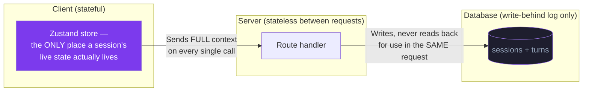

This is a deliberate, if implicit, architectural choice: the client is the system's actual source of truth for an active session, and the database is a durability/audit layer the active conversation never reads from. The practical consequence — already flagged in `docs/Architecture.md` §10 — is that this makes the *database* fully capable of supporting session recovery (`GET /session/{id}/turns` returns everything needed to reconstruct `conversation_history` and depth state) while the *frontend* implements no such recovery, leaving a built capability unused.

## 14. Data Flow

The turn-by-turn data flow for the core chat path is already sequence-diagrammed in `docs/Architecture.md` §7 and `docs/Database.md` §13. This section's contribution is a data-flow view organized by *data object* rather than by *call sequence* — tracing where each piece of information actually originates and where it ultimately lands:

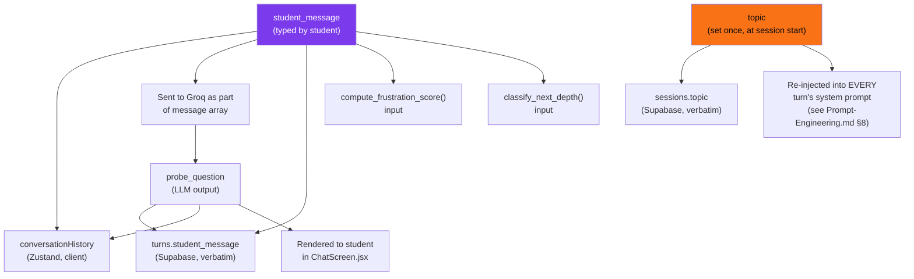

The single most consequential data-flow fact visible in this view, not stated this way in any prior document: **`student_message` and `topic` are the system's only two genuine external inputs, and they fan out into five and two destinations respectively** — every other value in the system (depth levels, frustration scores, prompts) is *derived* from these two strings. This is why both are repeatedly flagged as the system's primary risk surface across `docs/API.md`, `docs/Database.md`, and `docs/Prompt-Engineering.md` — they are not just two inputs among many; they are structurally the root of almost the entire data graph.

## 15. Control Flow

Where §14 traces data, this section traces *decisions* — the points in the system where control branches based on a condition, consolidated into one place for the first time across the documentation set:

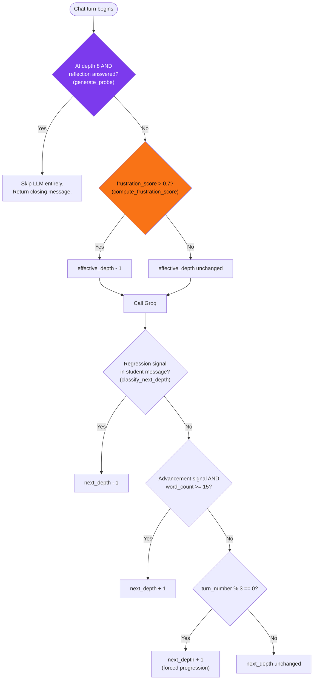

Every branch above is individually documented (depth termination and frustration softening in `docs/AI-Design.md` §8 and §10; depth classification priority order in §11) — what's new here is seeing that **the entire system's control flow is five sequential boolean gates**, all evaluated server-side, all deterministic, none of which involves the LLM's own judgment (the LLM only ever produces the *text* of the question — it never decides depth, frustration, or termination, as already established in `docs/AI-Design.md` §8's "the depth classifier and the LLM are decoupled"). Control flow in this system is entirely conventional Python logic; the LLM is, structurally, a leaf node, not a decision-maker.

## 16. Error Handling

The complete, accurate picture of error handling — or its absence — is documented in `docs/Architecture.md` §11 (Error Flow) and restated per-endpoint in `docs/API.md`. The system-level summary, stated once here for completeness: there is exactly one error-handling mechanism in the entire system (Pydantic's automatic 422 for malformed request bodies), and exactly one fallback behavior for everything else (an unhandled exception producing a raw 500, caught client-side by a single generic `catch` block in `ChatScreen.jsx` that renders an identical "Something went wrong" message regardless of cause). No retries, no circuit breakers, no graceful degradation, and no error taxonomy exist anywhere in the system. `docs/Architecture.md` §11's diagram is the canonical reference; this document does not reproduce it.

## 17. Security Architecture

Security-relevant facts are scattered across `docs/API.md` (per-endpoint Security Notes), `docs/Database.md` §14, and `docs/Prompt-Engineering.md` §18 (prompt injection). This section is the first place those facts are assembled into a single security posture:

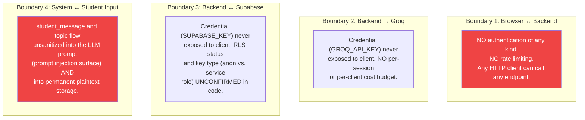

The honest system-level conclusion: **credential security is solid (Boundary 2 and 3 hold), but identity, authorization, and input-trust security are essentially absent (Boundary 1 and 4).** Anyone who can reach the backend's URL has the same capabilities as the legitimate frontend — they can create unlimited sessions (cost exposure), end or read the turn history of *any* session whose ID they can guess or obtain (`docs/API.md`'s notes on `/session/{id}/end` and `/session/{id}/turns`), and influence the LLM's behavior via unsanitized input (`docs/Prompt-Engineering.md` §18). None of this is hidden in the codebase — it is consistently and explicitly flagged in every document that touches it — but no document until this one states it as a single, system-wide security posture.

## 18. Scalability Considerations

No prior document treats scalability as its own topic; this section is new synthesis grounded in facts established elsewhere. The system's scalability ceiling is set by three compounding factors:

**Fully synchronous request handling (§6).** Because every route is a blocking `def`, not `async def`, and every Supabase/Groq call blocks the handling thread for its full duration, the number of concurrent in-flight requests the backend can serve is bounded by however many worker processes/threads the deployment runs (unconfirmed — no deployment configuration exists in the repository, per `docs/Architecture.md` §12) rather than by an async event loop's much higher concurrency ceiling.

**Unbounded conversation history (already flagged from a cost angle in `docs/AI-Design.md` §17 and from a prompt-salience angle in `docs/Prompt-Engineering.md` §9).** At the system level, this also means *per-request* payload size and Groq token usage both grow monotonically with session length — a system with many long-running sessions concurrently active would see both rising latency per call and rising cost per call simultaneously, with no mechanism anywhere to cap either.

**No horizontal-scaling primitives exist.** Because the backend is fully stateless between requests (§13), it is *theoretically* easy to run multiple backend instances behind a load balancer — nothing in the request-handling logic assumes process-local state. But nothing in the repository actually does this (no deployment manifest, no process manager config, no evidence of more than a single `uvicorn` process being run, per `docs/Architecture.md` §12) — the system is stateless-by-accident-of-simplicity, not stateless-by-deliberate-scaling-design, and the infrastructure to actually exploit that statelessness does not exist yet.

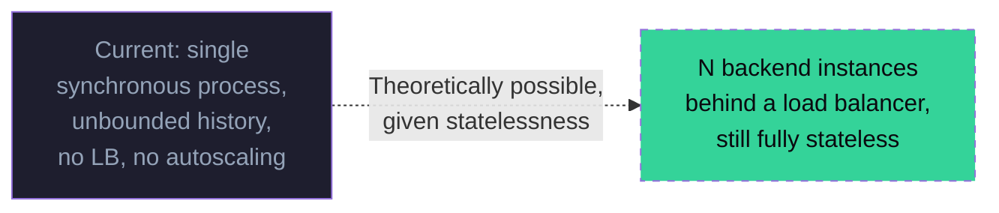

## 19. Performance Considerations

Also new synthesis, grounded in facts established across multiple documents. The system's dominant latency cost, by a wide margin, is the single Groq completion call per turn — every other operation in the request path (Pydantic validation, frustration scoring, depth classification, prompt assembly, two Supabase writes) is, individually, negligible by comparison (`docs/Prompt-Engineering.md` §7 makes this point specifically about prompt construction; it generalizes to the rest of the non-LLM pipeline too). Groq's selling point as a provider is specifically low-latency inference (`docs/AI-Design.md` §15), which is the system's only meaningful performance lever actually being exercised — there is no caching of LLM responses (each is necessarily unique, given they're conditioned on fresh conversation history), no precomputation, and no client-side optimistic rendering of the AI's response (the UI shows a generic typing indicator, not a token-by-token stream, while genuinely waiting for the full blocking response — `docs/AI-Design.md` §15's "No streaming").

The two Supabase writes per turn (`save_turn()` and `update_session()`) are sequential, not parallelized (`docs/Database.md` §17 already flags this as a consistency gap; it is also, independently, a latency cost — two sequential network round-trips to Supabase add up on every single turn, where they could in principle be issued concurrently if eventual consistency between the two tables were acceptable, or combined into a single Supabase RPC call as suggested in `docs/Database.md` §16).

## 20. Logging Strategy

There is no logging strategy in this system — this is a direct, verifiable fact, not an inference. No call to Python's `logging` module, no structured-logging library, and no log statement of any kind exists anywhere in `backend/app/`, beyond one stray `console.log("BACKEND RESPONSE:", result)` left in `ChatScreen.jsx` on the frontend (a debugging leftover, not a logging strategy, and one that runs in the student's own browser console rather than anywhere centrally collectible). FastAPI/uvicorn's own default access logging (request method, path, status code, to stdout) is the *only* operational visibility this system has by default, and even that is contingent on however `uvicorn` is actually invoked in production — unconfirmed, per `docs/Architecture.md` §12's deployment-topology gap.

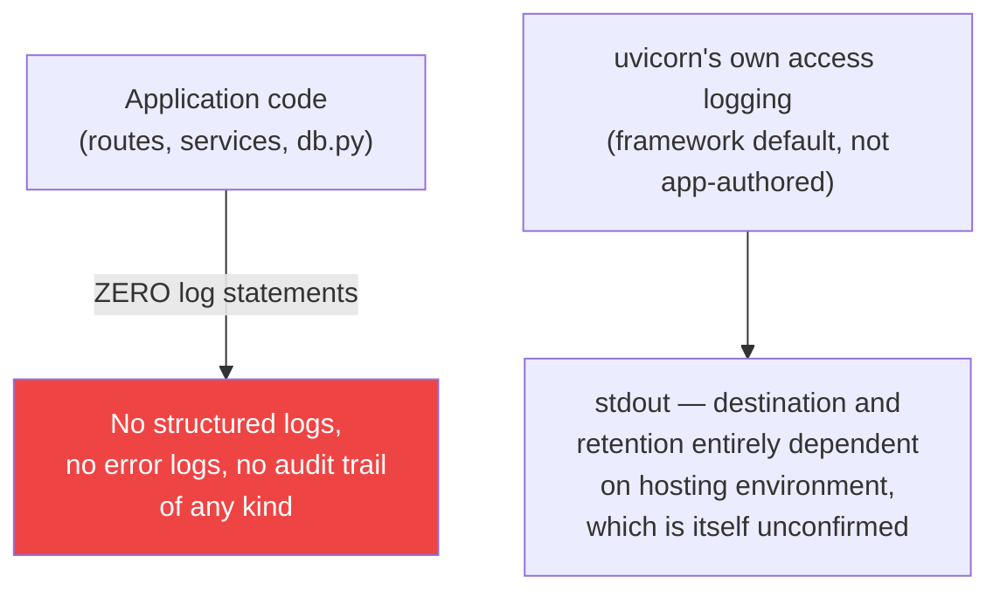

This means, concretely, that when a 500 error occurs in production (the system's only error path, per §16), there is no application-level record of *which* request caused it, *which* student/session was involved, or *what specifically* failed beyond whatever happens to land in uvicorn's default access log line and the raw traceback returned to the client itself (which the client's generic error handler — `docs/Architecture.md` §11 — never even surfaces to a developer, only to the student as a generic message).

## 21. Monitoring Strategy

Following directly from §20: there is no monitoring strategy, because there is nothing to monitor *from* beyond `GET /health` and `GET /` (`docs/API.md`'s documented limitation that neither endpoint checks Groq or Supabase reachability, meaning a "healthy" response provides no actual guarantee that `/chat/probe` — the only endpoint that matters to the product — will succeed). No metrics library, no APM integration, no error-tracking service (e.g., Sentry), and no alerting configuration exists anywhere in the repository.

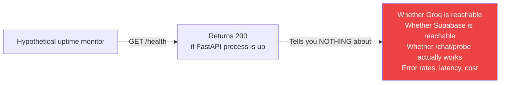

The practical consequence for an operator: today, the *first* signal that something is wrong with this system would be a student reporting "it's broken," not an automated alert — there is no instrumentation anywhere capable of detecting a Groq outage, a Supabase quota exhaustion, or an elevated 500 rate before a human notices the symptom directly.

## 22. Deployment Architecture

The full, honest accounting of what is and isn't confirmed about deployment — the Vercel-hosted frontend inferred from the CORS allowlist, the completely unconfirmed backend hosting, the absence of any Dockerfile, Procfile, or CI/CD configuration — is documented exhaustively in `docs/Architecture.md` §12, including its own deployment-topology Mermaid diagram. That diagram is the canonical reference and is not reproduced here. This document's addition is placing that gap in context relative to the rest of this document: deployment is the single least-defined layer of the entire system, and it is the layer that determines the real-world answers to nearly every open question raised in §18 (how many backend processes actually run), §20 (where logs actually go), and §21 (whether any monitoring is layered on by the hosting platform itself, outside this codebase's visibility). Until deployment configuration is added to the repository, every claim in §18–§21 about *theoretical* scalability, observability, or operational characteristics remains exactly that — theoretical, not confirmed.

## 23. Design Decisions

A consolidated table of the system's major, deliberate-or-inferred design decisions, gathered from across all five referenced documents into one place, alongside the section where each is treated in full:

| Decision | Rationale (summarized) | Full treatment |
|---|---|---|
| Route all external calls through the backend, never directly from the client | Keeps Groq/Supabase credentials server-side; centralizes business logic | `docs/Architecture.md` §1 |
| Prompt engineering instead of fine-tuning | No training data; cost; iteration speed; task fits prompting well | `docs/Prompt-Engineering.md` §3 |
| Supabase over self-hosted Postgres | Zero infra setup, free tier, REST-style client | `docs/Database.md` §3 |
| Groq + open-weight model over a frontier model API | Low latency, free tier, cost-conscious | `docs/AI-Design.md` §15 |
| Fully synchronous backend (no `async def`) | Simplicity, likely unexamined rather than deliberately chosen | §6, §18 (this document) |
| No ORM, no migration tooling | Minimal infrastructure, fast iteration, at the cost of schema confirmability | `docs/Database.md` §11 |
| Client supplies full conversation context on every call (stateless backend) | Simplicity; avoids server-side session storage | §13 (this document) |
| Eight-level depth structure as data, not branching logic | Maintainability; treats depth as "a teachable structure, not a black box" | `docs/AI-Design.md` §3.2, `docs/Prompt-Engineering.md` §6 |
| Frustration affects depth selection only, never injected as text into the prompt | Keeps the model's task mechanically simple and consistent across turns | `docs/Prompt-Engineering.md` §11 |
| No output-side validation of LLM responses | Trusts the prompt alone; avoids a second LLM call's cost/latency | `docs/AI-Design.md` §16, `docs/Prompt-Engineering.md` §14 |

## 24. Known Limitations

This section consolidates only the limitations that are genuinely *system-wide* — visible at the intersection of multiple layers — rather than re-listing every layer-specific limitation already catalogued in `docs/AI-Design.md` §17, `docs/Database.md` §15, and `docs/Prompt-Engineering.md` §19 individually:

1. **No authentication or rate limiting at any layer**, meaning every cost-bearing, data-exposing, and abuse-prone capability documented separately across `docs/API.md` and `docs/Database.md` §14 compounds into a single, system-wide exposure rather than several independent ones.
2. **No observability of any kind** (§20–§21) means every other limitation in this system — a Groq outage, a prompt regression, an injection attempt succeeding, a data-consistency gap between `turns` and `sessions` — is invisible to an operator until a student reports a symptom.
3. **The `session_complete` contract bug** (§11) is a concrete instance of a broader pattern: the frontend and backend are developed against each other's *assumed* behavior with no contract-testing or shared schema validation layer, meaning a backend change can silently break frontend behavior (or vice versa) with nothing in the system catching it before a human does.
4. **Deployment is entirely unconfirmed** (§22), which means every scalability and performance claim in this document is necessarily conditional rather than verified against a real production topology.
5. **No automated tests exist anywhere in the system** (confirmed empty `backend/tests/` directory, already noted in `docs/AI-Design.md` §17 and `docs/Database.md` §15) — this is the single root cause behind why limitations 1–4 above can persist undetected; there is no test suite at any layer that would catch a regression in auth, observability, contract correctness, or deployment configuration.

## 25. Future Improvements

These follow directly from §24 and are documented as possibilities, consistent with how every other document in this set frames its own future-improvements section — not commitments, not a roadmap:

- **Introduce authentication and per-client rate limiting** at the API gateway or middleware level, directly closing the system-wide exposure described in limitation 1.
- **Add a structured logging library and centralized log aggregation**, plus extend `/health` to actually check Groq and Supabase reachability, closing the observability gap in limitation 2 and giving §21's hypothetical monitoring something real to alert on.
- **Adopt a shared API schema or contract-testing approach** (e.g., generating frontend types from the backend's OpenAPI schema, or a contract test asserting `ChatResponse` actually includes `session_complete`) to prevent silent frontend/backend drift like the bug described in §11 and limitation 3.
- **Formalize deployment** with a Dockerfile, process manager configuration, and CI/CD pipeline, resolving limitation 4 and making every scalability/performance claim in §18–§19 independently verifiable rather than theoretical.
- **Build a test suite spanning all layers** — unit tests for the deterministic logic (frustration scoring, depth classification, prompt assembly), integration tests for the database functions, and at least a smoke-test suite for the API contract — directly addressing limitation 5, the structural root cause underlying most of this document's other findings.
- **Introduce async request handling** (`async def` routes, an async Supabase/Groq client) to remove the synchronous-blocking ceiling described in §18, if and when concurrent load actually becomes a measured concern rather than a theoretical one.
- **Add request/session-level cost controls** (a per-session turn cap, or a per-client rate limit specifically on `/chat/probe`) to bound the system's exposure to runaway Groq costs, the most concrete financial risk identified anywhere in this document set.
